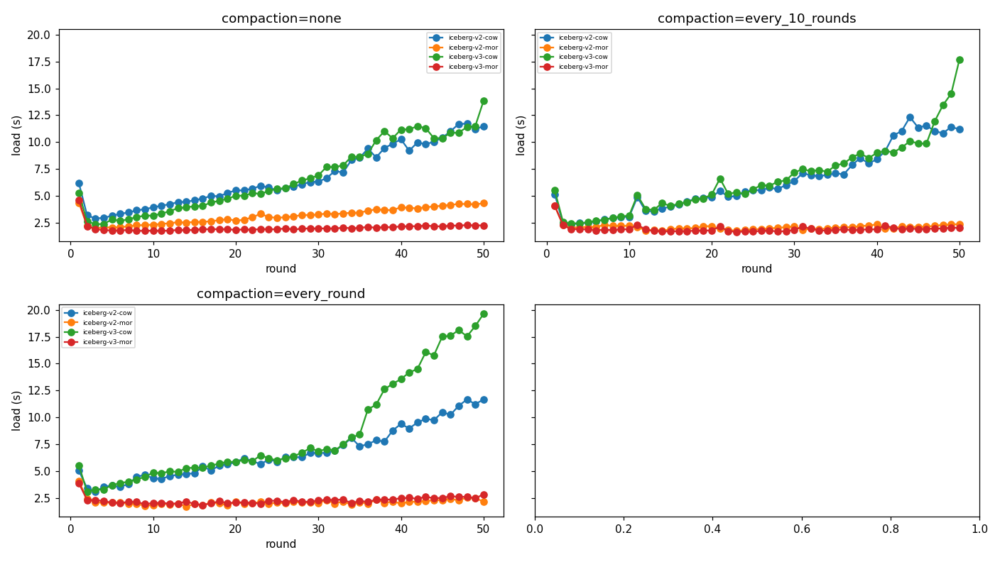
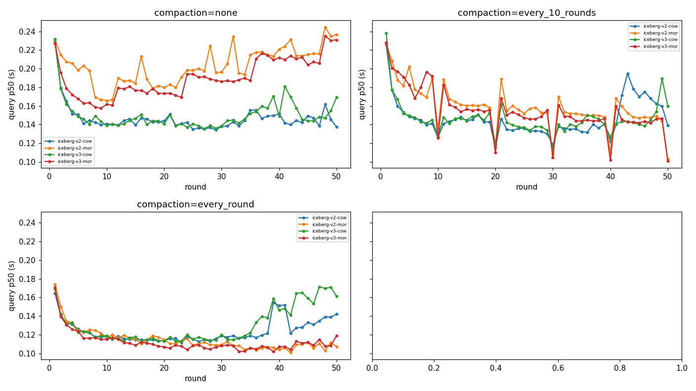
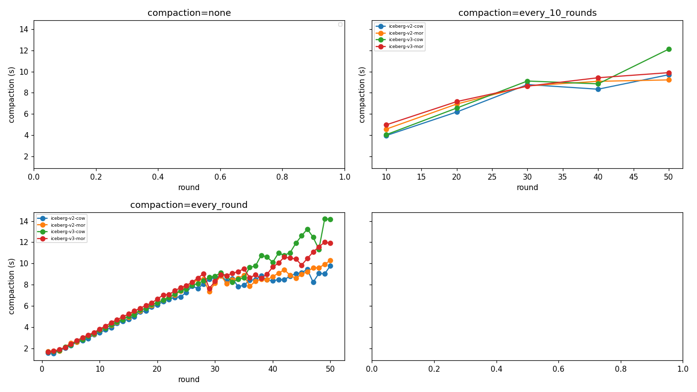

# 🧊 table-bench-mark

> **Iceberg 테이블 포맷을 실시간 적재–조회 관점에서 공정하게 벤치마크하는 프레임워크**
> 적재는 **Apache Spark**, 조회는 **StarRocks / Spark**, 카탈로그는 **Apache Polaris**(REST), 스토리지는 **MinIO(S3)**.

쓰기가 빈번하고 **적재→조회 지연(load-to-query latency)** 이 중요한 워크로드에서,
어떤 Iceberg 구성이 가장 좋은지 **재현 가능한 수치**로 답하기 위해 만들었습니다.

> 📌 **결론 보고서**: 실험 결과 기반 포맷·compaction 전략 권장 → **[docs/recommendation.md](docs/recommendation.md)**
> (요약: MOR + 주기적 compaction; 조회 Spark면 `v3-MOR`, StarRocks 4.1이면 `v2-MOR`).

---

## 🎯 무엇을 비교하나

3개 축을 조합해 테스트합니다.

| 축 | 값 |
|---|---|
| Iceberg 포맷 버전 | **v2**, **v3** |
| 쓰기 모드 | **COW**(copy-on-write), **MOR**(merge-on-read) |
| compaction 주기 | **없음**, **매 라운드**, **격 라운드** |
| 조회 엔진 | `read_engines`로 선택(현재 **Spark 3.5**; **StarRocks 4.1.1** 도 옵션) |

→ 시나리오 4개(v2/v3 × COW/MOR) × compaction 3모드를 **동일한 시드 데이터**로 측정합니다.
핵심 관점은 **각 compaction 정책 하에서 버전·모드 비교**(COW vs MOR, v2-MOR vs v3-MOR, v2-COW vs
v3-COW). 정밀도·신뢰도를 위해 **측정환경을 격리**하고 **전체를 N회 반복·평균**합니다(아래 *방법론*).

## 📊 핵심 결과 한눈에

> ⚠️ 아래 수치/그래프는 **구 방법론(100k×10라운드, StarRocks 조회) 예시**이며 신 방법론(30컬럼·
> 50라운드·compaction·다회 평균)으로 **재생성 예정**입니다. 전체 리포트: [docs/sample-results/report.md](docs/sample-results/report.md)

**① 호환성 — v3 MOR은 compaction을 해야 StarRocks가 읽는다**

| 시나리오 | Spark 조회 | StarRocks 조회 |
|---|---|---|
| v2-cow / v2-mor / v3-cow | ✅ | ✅ |
| **v3-mor / compaction 없음** | ✅ | ❌ (deletion vector 미지원) |
| **v3-mor / 매 라운드 compaction** | ✅ | ✅ |
| **v3-mor / 격 라운드 compaction** | ✅ | 🔶 (compaction 한 라운드만) |

StarRocks 3.5·4.1 모두 Iceberg **v3 MOR의 deletion vector를 직접 읽지 못합니다.**
유일한 해법은 `rewrite_data_files` **compaction으로 deletion vector를 데이터 파일에 흡수**시키는 것.

**② 쓰기 비용: MOR ≈ COW의 절반 / compaction은 적재보다 비싸다**



- MOR 적재 ~4초 vs COW 적재 ~8–9초 (COW는 merge 때 데이터 파일 재작성)
- compaction 1회 ~9–11초 → 매 라운드면 총 ~95초, 격 라운드면 ~50초의 추가 비용

**③ 조회는 StarRocks가 2–3배 빠르다**



- StarRocks p50 ~0.05–0.09초, Spark ~0.13–0.23초



### 💡 결론
- **StarRocks로 조회한다면 `v2-MOR`가 최적** — compaction 없이도 읽히고, 쓰기 저렴 + 조회 빠름.
- **`v3-MOR`는 StarRocks 조회 시 비추천** — 쓰기는 싸지만 읽으려면 매 라운드 compaction(~10초)이 필요해 저지연 이점을 상쇄.
- **COW(v2/v3)** 는 compaction 없이 조회되지만 쓰기 비용이 큼.

---

## 🚀 빠른 시작

전제: Docker Desktop 실행 중 + `docker-compose`(v1.29+). **측정 안정성을 위해 Docker VM 을 먼저
≥24g/8코어로** 키우세요(Settings→Resources). VM 이 작으면 내부 스왑으로 처리시간이 튑니다.

```bash
cp .env.example .env
scripts/run.sh up        # 전체 스택 기동 (minio·postgres·polaris·spark·starrocks·runner)
scripts/run.sh smoke     # 소량 정상성 점검 (모든 시나리오 × compaction)
scripts/run.sh bench     # 풀 벤치마크 100k×50라운드 -> results/<timestamp>/report.md (+그래프)
scripts/run.sh report    # 리포트 재생성
scripts/run.sh down      # 중지 (down -v 로 볼륨 삭제)
```

**다회 평균(신뢰도)**: 같은 설정으로 `bench` 를 N회 실행한 뒤 평균 리포트를 만듭니다.
```bash
python -m bench aggregate --run-dirs results/bench-A results/bench-B results/bench-C \
                          --output-dir results/avg-<라벨>
```

조회용 StarRocks 버전은 `.env` 의 `SR_VERSIONS` 로 바꿀 수 있습니다. 컨테이너 자원 캡(`SPARK_MEM`
등)과 측정 정착(`BENCH_SETTLE_S`)도 `.env` 에서 조정합니다.

## 🧪 벤치마크 시나리오

1. **30컬럼** 테이블(double 24 / 정수 3 / char(16) 3, 정수에 `pk_id`·`round_id` 포함), 초기 10만 행 시드
2. 매 라운드 10만 행 **upsert**(Spark `MERGE INTO`), compaction 주기에 따라 compaction(+maintain) 수행
3. **freshness**(쓰기→가시성): 커밋 직후 최신 `round_id` 가 보일 때까지 — 경량 가시성 프로브로 측정
4. **조회**: 직후 **최근 2회차(~20만 행)** 를 반복 측정해 p50/p95
5. **50라운드** 반복하며 load/compact/maintain/freshness/query 시간 기록

**공정성·정밀도 규칙**: 랜덤 데이터는 사전에 시드 Parquet으로 1회 생성(측정 제외)·동일 바이트 사용,
Polaris 메타데이터 캐시 비활성, **측정 직전 정착(settle)**, **컨테이너 자원 캡 + Docker VM 사이징**으로
스왑/경합 차단, 그리고 **N회 반복·평균**으로 신뢰도 확보. 자세한 방법론은 **[CLAUDE.md](CLAUDE.md)** 참조.

## 🏗️ 아키텍처

```
MinIO(S3) ─ Polaris(Iceberg REST 카탈로그) ─ Spark(적재/조회) ─ StarRocks(조회) ─ Python 러너
                         └ Postgres(메타데이터)
```
모두 `docker-compose` 로 컨테이너화. 자세한 설계·확장법·트러블슈팅은 **[CLAUDE.md](CLAUDE.md)** 참조.

## ➕ 새 시나리오 추가

`benchmark/config/candidates/<name>.yaml` 한 개만 추가하면 됩니다(코드 변경 불필요):
```yaml
name: iceberg-v3-mor
adapter: iceberg_spark
write_engine: spark
table_format: iceberg
mode: mor
catalog: polaris
iceberg_format_version: 3
table_properties: { write.merge.mode: merge-on-read, ... }
```

## 📁 구조
```
benchmark/        # Python 오케스트레이터 (config·datagen·runner·report·engines·adapters)
infra/            # minio·polaris·spark 부트스트랩/이미지
docker-compose.yml
scripts/run.sh    # up/gen/smoke/bench/report/down
docs/sample-results/   # 예시 리포트 + 그래프
```

## 🛠️ 기술 스택
Apache Iceberg(v2/v3) · Apache Polaris 1.5 · Apache Spark 3.5(Spark Connect) · StarRocks 3.5/4.1 ·
MinIO · PostgreSQL 16 · Python 3.11 · Docker Compose

---

*이 프로젝트는 데이터 플랫폼의 lakehouse 포맷 선정을 위한 내부 벤치마크입니다. 문서·리포트는 한국어, 코드 주석은 영어로 작성되어 있습니다.*
