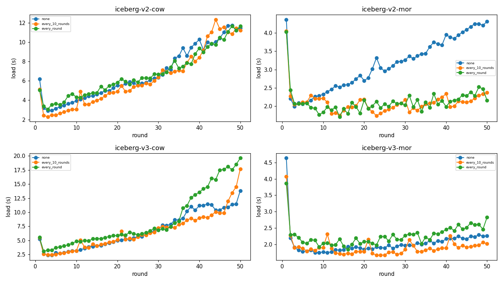
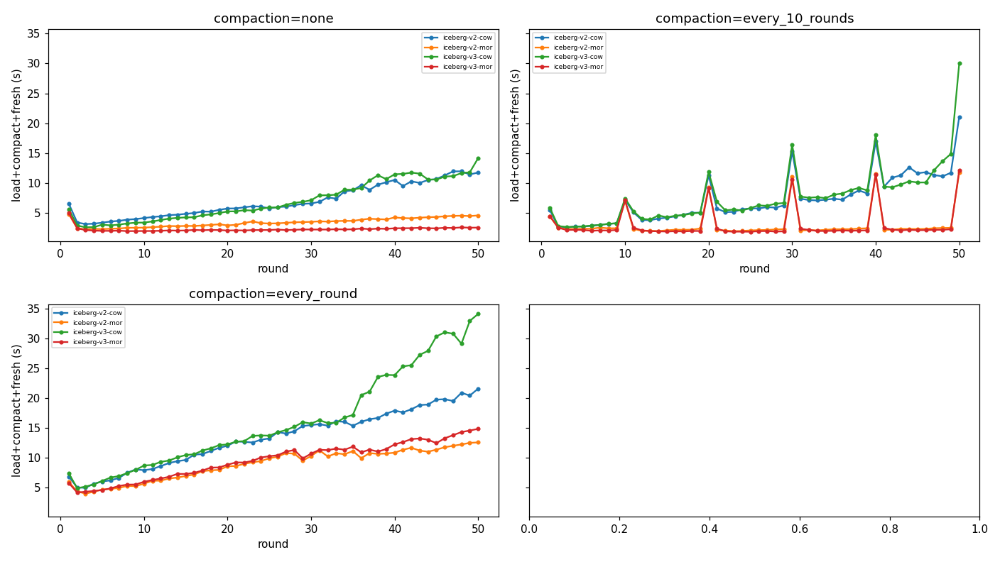
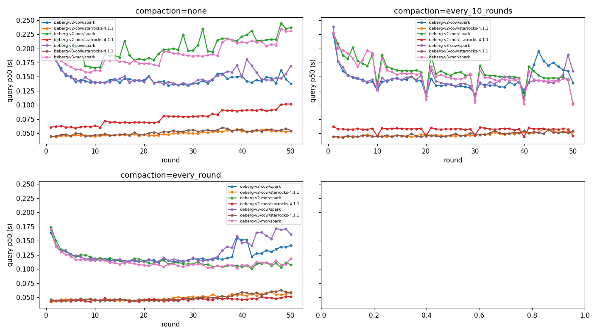

# Iceberg 포맷·쓰기모드·compaction 전략 선정 보고서

> **유즈케이스**: 실시간·쓰기 빈번 워크로드에서 **적재→조회 지연(load-to-query latency)** 을 최소화.
> **근거 데이터**: 본 벤치마크(30컬럼·10만행/라운드·50라운드 upsert) — 측정환경 격리 + **3회 반복·평균**,
> Spark·StarRocks 두 조회 엔진. 전체 수치는 [results/](../results/) 및 [sample-results](sample-results/report.md).

---

## 0. 결론 먼저 (TL;DR)

| 항목 | 권장 |
|---|---|
| **쓰기 모드** | **MOR(merge-on-read)** — COW 대비 적재 **~1/3**, 테이블이 커져도 평탄 |
| **compaction** | **주기적 compaction 필수** — 매 라운드(`every_round`)가 조회·freshness 최저. 인프라 제약 시 `every_10_rounds`로 절충 |
| **포맷 버전 (조회 엔진에 종속)** | 조회가 **Spark류(v3 deletion vector 읽기 가능)** → **`v3-MOR`** / 조회가 **StarRocks 4.1** → **`v2-MOR`** |
| **피해야 할 것** | **COW 전반**(쓰기 비용), 특히 **v3-COW + 공격적 compaction**(row-lineage 연산 폭증), **StarRocks로 v3-MOR 조회**(deletion vector 비호환) |

**한 줄 권장**: *MOR + 주기적 compaction을 기본으로 하고, 포맷 버전만 조회 엔진의 v3-MOR 호환 여부로 정하라.*
Spark로 읽으면 `v3-MOR / every_round`, StarRocks 4.1로 읽으면 `v2-MOR / every_round`.

---

## 1. 평가 기준과 비용 우선순위

실시간·쓰기빈번 + 저지연이 목표이므로 다음 순으로 가중한다.

| 지표 | 의미 | 워크로드에서의 중요도 |
|---|---|---|
| **적재(load)** | 라운드당 staging→테이블 쓰기 시간 | ★★★ (쓰기 빈번 → 누적 비용 지배) |
| **freshness** | 커밋→조회 가능까지의 가시성 지연 | ★★★ (실시간성의 핵심) |
| **조회(query) p50** | 정상상태 최근 2회차 조회 지연 | ★★★ (저지연 목표) |
| **compaction·maintain** | 파일 정리 추가 쓰기 비용 | ★★ (운영 비용, 분리 가능) |
| **호환성** | 조회 엔진이 그 테이블을 읽는가 | ★★★ (불가하면 후보 탈락) |

비교군: **Iceberg {v2,v3} × {COW,MOR} = 4 방식** × **compaction {none, every_10_rounds, every_round}**
× **조회 {Spark, StarRocks 4.1}**.

### 측정 신뢰도
전 매트릭스를 **3회 반복·평균**했고, run 간 변동계수(CV)는 아래로 작아 수치가 재현 가능하다.

| 지표 | run 간 CV |
|---|---|
| 적재(load) | 2.1% |
| 조회(query) | Spark 1.4% / StarRocks 2.5% |
| freshness | Spark 3.8% / StarRocks 4.0% |

---

## 2. 근거 ① — 쓰기 비용: MOR ≈ COW의 1/3 (가장 결정적)

라운드당 적재 시간(3회 평균, 초). COW는 `MERGE` 시 데이터 파일을 통째로 재작성하므로 테이블이 커질수록
증가하고, MOR은 삭제 표식(v2 positional delete / v3 deletion vector)만 추가해 **평탄**하다.

| 방식 | none | every_10_rounds | every_round |
|---|---|---|---|
| v2-COW | 6.71 | 6.33 | 6.61 |
| v3-COW | 7.16 | 6.52 | **8.67** |
| **v2-MOR** | 3.24 | **2.18** | **2.01** |
| **v3-MOR** | 2.10 | **1.93** | 2.09 |

> **MOR이 COW의 약 1/3** (every_round: 2.0s vs 6.6~8.7s). 쓰기 빈번 워크로드에서 이 격차는 라운드마다
> 누적되어 사실상 결정적이다.



위 그래프(패널=방식, y축 공유)에서 **COW 패널(위쪽)이 MOR 패널보다 명백히 높고**, **v3-COW의 every_round
선만 후반에 급격히 치솟는다**. 아래는 그 원인 계측.

### v3-COW + every_round = 최악 조합 (row-lineage 계측 확정)
`every_round`는 매 라운드 데이터를 소수 대형 파일로 뭉쳐, 다음 MERGE가 **테이블 전체를 재작성**하게 만든다.
그 포화 구간(≈라운드 35~40)부터 v3-COW만 급증한다.

| 구간 | v2-COW 적재 | v3-COW 적재 | v3/v2 |
|---|---|---|---|
| R35 | 9.4s | 9.3s | 1.0× |
| R40 | 9.2s | 17.9s | **1.94×** |
| R50 | 14.5s | 22.2s | 1.53× |

| 계측 항목 (R50, every_round) | v2-COW | v3-COW |
|---|---|---|
| 재작성 행수 | 4.1M | 4.1M (동일) |
| 재작성 파일수 | 8 | 8 (동일) |
| 행당 바이트 | 223.1 | 224.5 (+0.6%) |
| **적재 시간** | **14.5s** | **22.2s (1.53×)** |

> **동일한 I/O인데 시간만 1.5~1.9× 더 걸린다** → 쓰기량(row-lineage 컬럼 크기)이 아니라, v3가 **모든 행에
> 의무적으로 유지하는 row-lineage(`_row_id`,`_last_updated_sequence_number`)의 per-row 연산 오버헤드**다.
> row-lineage는 v3 스펙 필수라 **끌 수 없다**. → **공격적 compaction을 도는 대형 COW라면 v2가 v3보다 쓰기 저렴.**

---

## 3. 근거 ② — compaction 전략: 주기성은 조회·freshness를 사고, 대가는 (COW만) 쓰기

compaction(`rewrite_data_files`)은 small file을 병합하고 삭제를 데이터에 흡수해 **조회·freshness를 낮춘다**.
대신 **추가 쓰기 비용**이 든다 — 단, 그 비용은 **MOR이면 load와 분리되어 평탄**, **COW면 load 자체가 폭증**.

### compaction 주기별 조회 p50 (Spark, 초) — every_round가 최저
| 방식 | none | every_10 | every_round |
|---|---|---|---|
| v2-COW | 0.147 | 0.146 | 0.124 |
| v2-MOR | 0.203 | 0.159 | **0.115** |
| v3-COW | 0.150 | 0.146 | 0.130 |
| v3-MOR | 0.190 | 0.154 | **0.112** |

> 특히 **MOR은 compaction이 없으면 조회가 느리다**(삭제를 조회 때 실시간 병합). compaction이 삭제를
> 흡수하면 COW급으로 빨라진다(v2-MOR 0.203→0.115, v3-MOR 0.190→0.112). 즉 **MOR의 약점(읽기)을
> compaction이 메운다.**

### compaction·maintain 추가 비용 (초)
| 방식 | every_10 compaction 총합 | every_round compaction 총합 | maintain 총합(every_round) |
|---|---|---|---|
| v2-COW | 37.3 | 326.9 | 38.5 |
| v2-MOR | 39.3 | 338.3 | 37.5 |
| v3-COW | 39.5 | 384.2 | 43.1 |
| v3-MOR | 40.5 | 364.4 | 39.7 |

> every_round의 compaction 총비용(~330~380s)은 every_10(~40s)의 ~9배다. **리소스가 빠듯하면
> `every_10_rounds`가 합리적 절충**(조회·freshness 이득의 대부분을 가져오면서 compaction 비용은 1/9).


### 3-1. 통합 지연 = 적재 + compaction + freshness (compaction을 임계경로에 넣으면?)

세 값은 겹치지 않는 별개 구간이라 단순 합산이다(load=쓰기, compaction=재작성, freshness=가시성; maintain 제외).
compaction은 라운드 전체에 분산(총비용÷라운드)해 라운드당으로 환산. **Spark 기준(초):**

| 방식 | none | every_10 | every_round |
|---|---|---|---|
| v2-COW | 6.91 | 7.21 | 13.28 |
| v3-COW | 6.92 | 7.60 | 16.12 |
| **v2-MOR** | 3.36 | **3.04** | 8.90 |
| **v3-MOR** | **2.23** | 2.89 | 9.57 |



> **해석(중요)**: compaction **비용까지 임계경로에 포함**하면 `every_round`는 오히려 통합 지연이 **가장 크다**
> (compaction ~6.5s/라운드가 지배). 이 가정에서 최적은 **MOR + none 또는 every_10**(v3-MOR none 2.23,
> v2-MOR every_10 3.04). **단, 실무에서 compaction은 보통 적재 파이프라인과 분리된 백그라운드 작업**이라
> 적재→조회 임계경로에 들지 않는다 — 그 경우 compaction을 빼고 보면 `every_round`의 조회·freshness 이득이
> 살아난다. → **권장**: compaction은 **백그라운드로 운영**(그러면 every_round 유효), 동기적으로 끼워야 하면
> **`every_10_rounds`**가 균형점. (어느 쪽이든 **MOR**은 불변.)

---

## 4. 근거 ③ — 조회·freshness와 **조회 엔진**이 포맷을 가른다

### 조회 p50 — Spark vs StarRocks (초)
| 방식 | compaction | Spark | StarRocks 4.1 | SR÷Spark |
|---|---|---|---|---|
| v2-COW | every_round | 0.124 | 0.050 | 0.40× |
| v2-MOR | every_round | 0.115 | **0.046** | 0.40× |
| v3-COW | every_round | 0.130 | 0.049 | 0.38× |
| **v3-MOR** | every_round | **0.112** | **— (비호환)** | — |

> **StarRocks가 Spark보다 조회 ~2.8× 빠르다(평균 SR÷Spark 0.36×).** 하지만 **v3-MOR의 deletion vector를
> 직접 읽지 못한다(✗)** — 어떤 compaction에서도 불가.

### freshness(write→read, 초) — every_round 기준
| 방식 | Spark | StarRocks 4.1 |
|---|---|---|
| v2-COW | 0.163 | 0.113 |
| v2-MOR | 0.156 | **0.109** |
| v3-COW | 0.178 | 0.127 |
| v3-MOR | **0.153** | — (비호환) |

### 호환성 매트릭스 (조회)
| 방식 | Spark | StarRocks 4.1 |
|---|---|---|
| v2-COW / v2-MOR / v3-COW | ✓ | ✓ |
| **v3-MOR** | ✓ | **✗ (deletion vector 미지원)** |



> **경향성 차이**: Spark 최적은 `v3-MOR`, StarRocks 최적은 `v2-MOR`. **조회 엔진 선택이 최적 포맷을 바꾼다.**

---

## 5. 의사결정 — 소거법

| 단계 | 판단 | 탈락/생존 |
|---|---|---|
| ① 쓰기 비용 | COW는 적재가 MOR의 3배 + 테이블 성장 비례 | **COW 탈락** (v2-COW, v3-COW) |
| ② v3-COW 추가 | every_round에서 row-lineage 연산으로 v2 대비 1.5~1.9× | **최악, 확정 배제** |
| ③ 남은 후보 | v2-MOR, v3-MOR | 둘 다 적재 평탄·저비용 |
| ④ compaction | MOR은 compaction으로 조회 약점 해소 | **every_round(또는 every_10)** |
| ⑤ 포맷 버전 | v3-MOR이 쓰기·조회·freshness 근소 우위지만 **StarRocks 비호환** | **조회 엔진으로 분기** |

→ **MOR + 주기적 compaction**이 공통 정답이고, **v2 vs v3는 조회 엔진의 v3-MOR 호환 여부**로 결정된다.

### 균형 점수(정규화, 1.0=모든 지표 최저) — Spark 조회 기준
| 구성 | 종합 점수 |
|---|---|
| **v3-MOR / every_round** | **1.03 (최적)** |
| v2-MOR / every_round | ~1.05 |
| v2-COW / every_round | (쓰기 열위) |
| v3-COW / every_round | (최악) |

---

## 6. 권장 구성 (설정 치트시트)

### 공통
```yaml
# table_properties (Iceberg)
write.delete.mode: merge-on-read
write.update.mode: merge-on-read
write.merge.mode:  merge-on-read
write.parquet.compression-codec: zstd
# 운영: 주기적 compaction + maintain
#   rewrite_data_files (every_round 기본 / 리소스 제약 시 every_10_rounds)
#   expire_snapshots(retain_last=1) + remove_orphan_files
```

### A) 조회 엔진이 v3-MOR을 읽는 경우 (Spark 등) — **권장: `v3-MOR`**
```yaml
name: iceberg-v3-mor
iceberg_format_version: 3
mode: mor
# 근거: 적재 2.1s, 조회 p50 0.112s, freshness 0.153s — 전 지표 최상위
```

### B) 조회 엔진이 StarRocks 4.1인 경우 — **권장: `v2-MOR`**
```yaml
name: iceberg-v2-mor
iceberg_format_version: 2
mode: mor
# 근거: StarRocks가 v3-MOR을 못 읽음(✗). v2-MOR은 호환 + StarRocks 조회 0.046s(2.8배 빠름)
#       + 적재 2.0s 평탄. compaction으로 MOR 조회 약점 해소.
```

> compaction 주기: **`every_round` 기본**(조회·freshness 최저). compaction 인프라 비용이 부담이면
> **`every_10_rounds`**로 — 조회·freshness 이득 대부분 유지, compaction 총비용은 ~1/9.

---

## 7. 트레이드오프·리스크 (정직한 한계)

- **compaction 운영 비용**: every_round는 라운드당 별도 compaction(~6~8s)·maintain이 필요. 적재 파이프라인과
  분리해 백그라운드로 돌려야 한다. 부담되면 every_10로.
- **포맷–엔진 결합**: v3-MOR의 우위는 **조회 엔진이 deletion vector를 읽을 때만** 성립. StarRocks/Trino 등
  엔진 버전의 v3 지원 여부를 먼저 확인하라(본 측정 시점 StarRocks 4.1은 ✗).
- **freshness 해석**: 단일 콜드 측정이라 라운드별 ±20% 진동은 정상. 절대값이 아니라 **분포(median)**로 본다.
  (본 보고서 값은 50라운드×3회 평균.)
- **스케일 한계**: 단일 머신·50라운드(테이블 ~4.1M행) 기준. 수십억 행/멀티노드에서는 절대값이 달라질 수
  있으나, **MOR≪COW·v3-COW 페널티·엔진 호환성**의 *방향성*은 유지될 가능성이 높다.

---

## 8. 결론

실시간·쓰기빈번 + 저지연 워크로드라면:

1. **MOR을 써라.** COW는 쓰기가 3배 비싸고 테이블 성장에 비례한다. 특히 **v3-COW + 공격적 compaction은
   row-lineage 연산으로 최악**이니 피하라.
2. **주기적 compaction을 켜라.** MOR의 유일한 약점(조회)이 compaction으로 사라진다. `every_round` 기본,
   리소스 제약 시 `every_10_rounds`.
3. **포맷 버전은 조회 엔진으로 정하라.** Spark류면 **`v3-MOR / every_round`**(전 지표 최상위),
   StarRocks 4.1이면 **`v2-MOR / every_round`**(호환 + 2.8배 빠른 조회).

> 전체 수치·그래프: [sample-results 리포트](sample-results/report.md) ·
> [엔진 병합 리포트](../results/avg-merged-3sr3spark-20260620-162934/report.md)
