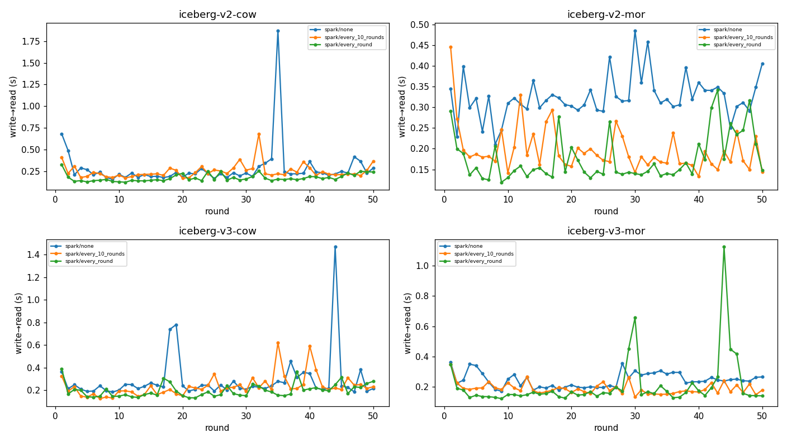
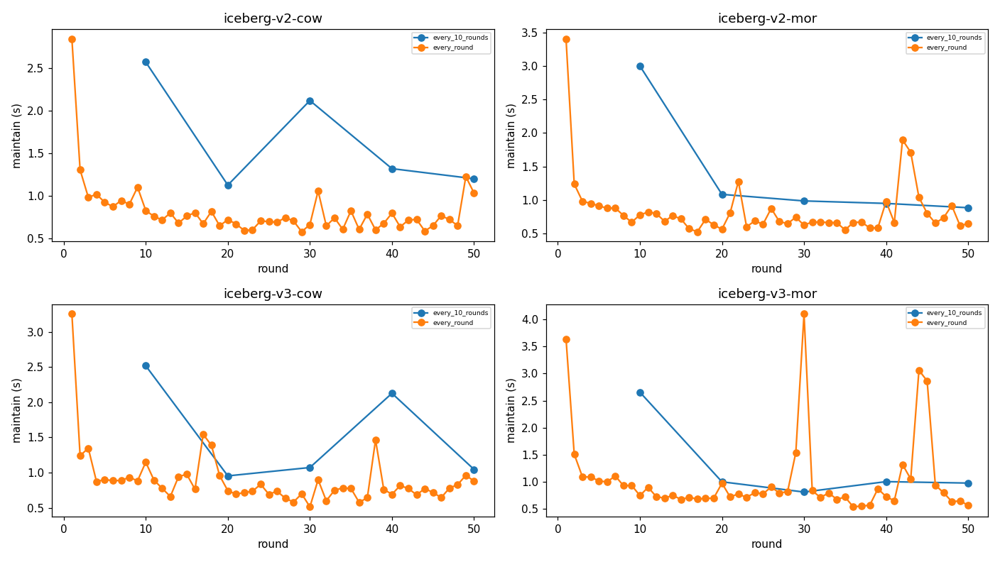

# table-bench-mark 결과 리포트

결과 디렉터리: `bench-20260616-133514` · 라운드 수: 50 · 압축: zstd(Parquet)

## 0. 방법론 · 지표 정의

- **목적**: 쓰기가 빈번한 워크로드에서 Iceberg 구성별 **적재→조회 지연**을 공정하게 비교.
- **적재 엔진** = Apache Spark(`MERGE INTO` 업서트), **조회 엔진** = StarRocks·Spark (동일 테이블을 두 엔진이 각각 조회). 카탈로그 = Polaris(REST), 스토리지 = MinIO(S3).
- **시나리오** = Iceberg 포맷버전(v2/v3) × 쓰기모드(COW/MOR). **compaction 모드** = none / every_10_rounds / every_round (Spark `rewrite_data_files`, MOR의 deletion vector·delete를 데이터파일에 흡수).
- **시나리오당 흐름**: 초기 시드 후 매 라운드 10만 행 업서트(신규 80% + 기존 PK 20% 갱신) → compaction(주기 해당 시) → 각 엔진이 최근 2회차(~20만 행) 조회.
- **지표**:
  - `적재(load)` = staging→테이블 1라운드 쓰기 시간(Spark).
  - `compaction` = rewrite_data_files 1회 시간(Spark).
  - `maintain` = compaction마다 스냅샷 1개만 남기고(expire) orphan 파일 제거하는 시간(별도 추적).
  - `freshness(write→read)` = **커밋 직후 새 데이터가 조회 가능해질 때까지의 지연** (폴링; 엔진이 못 읽으면 실패로 기록).
  - `조회(query)` = 가시화 이후 정상상태 조회 지연(반복 측정 p50).
- **공정성**: 랜덤 데이터는 사전 시드 Parquet으로 1회 생성(측정 제외), 모든 시나리오 동일 바이트, Polaris 메타데이터 캐시 비활성, 후보마다 새 테이블(격리).

## 1. 호환성 매트릭스 (✓ 정상 / △ 부분 / ✗ 불가 / - 없음)

| 시나리오           | compaction      | spark   |
|----------------|-----------------|---------|
| iceberg-v2-cow | none            | ✓       |
| iceberg-v2-cow | every_10_rounds | ✓       |
| iceberg-v2-cow | every_round     | ✓       |
| iceberg-v2-mor | none            | ✓       |
| iceberg-v2-mor | every_10_rounds | ✓       |
| iceberg-v2-mor | every_round     | ✓       |
| iceberg-v3-cow | none            | ✓       |
| iceberg-v3-cow | every_10_rounds | ✓       |
| iceberg-v3-cow | every_round     | ✓       |
| iceberg-v3-mor | none            | ✓       |
| iceberg-v3-mor | every_10_rounds | ✓       |
| iceberg-v3-mor | every_round     | ✓       |

## 2. 조회 지연 (정상상태 p50 평균, 초)

| 시나리오           | compaction      |   spark |
|----------------|-----------------|---------|
| iceberg-v2-cow | none            |   0.175 |
| iceberg-v2-cow | every_10_rounds |   0.172 |
| iceberg-v2-cow | every_round     |   0.122 |
| iceberg-v2-mor | none            |   0.252 |
| iceberg-v2-mor | every_10_rounds |   0.157 |
| iceberg-v2-mor | every_round     |   0.117 |
| iceberg-v3-cow | none            |   0.177 |
| iceberg-v3-cow | every_10_rounds |   0.166 |
| iceberg-v3-cow | every_round     |   0.137 |
| iceberg-v3-mor | none            |   0.213 |
| iceberg-v3-mor | every_10_rounds |   0.146 |
| iceberg-v3-mor | every_round     |   0.128 |

## 3. 신선도 write→read (커밋→조회가능 지연 평균, 초)

| 시나리오           | compaction      |   spark |
|----------------|-----------------|---------|
| iceberg-v2-cow | none            |   0.284 |
| iceberg-v2-cow | every_10_rounds |   0.25  |
| iceberg-v2-cow | every_round     |   0.176 |
| iceberg-v2-mor | none            |   0.325 |
| iceberg-v2-mor | every_10_rounds |   0.197 |
| iceberg-v2-mor | every_round     |   0.176 |
| iceberg-v3-cow | none            |   0.287 |
| iceberg-v3-cow | every_10_rounds |   0.232 |
| iceberg-v3-cow | every_round     |   0.196 |
| iceberg-v3-mor | none            |   0.246 |
| iceberg-v3-mor | every_10_rounds |   0.189 |
| iceberg-v3-mor | every_round     |   0.208 |

## 4. 적재 · compaction · maintain(스냅샷 expire+orphan) 비용 (초)

| 시나리오           | compaction      |   적재 평균(s) | compaction 평균(s)   |   compaction 총합(s) | maintain 평균(s)   |   maintain 총합(s) |
|----------------|-----------------|------------|--------------------|--------------------|------------------|------------------|
| iceberg-v2-cow | none            |      7.644 | —                  |                0   | —                |              0   |
| iceberg-v2-cow | every_10_rounds |      8.172 | 10.182             |               50.9 | 1.666            |              8.3 |
| iceberg-v2-cow | every_round     |      4.921 | 5.267              |              263.4 | 0.814            |             40.7 |
| iceberg-v2-mor | none            |      4.503 | —                  |                0   | —                |              0   |
| iceberg-v2-mor | every_10_rounds |      1.953 | 6.487              |               32.4 | 1.383            |              6.9 |
| iceberg-v2-mor | every_round     |      2.114 | 6.078              |              303.9 | 0.848            |             42.4 |
| iceberg-v3-cow | none            |      8.294 | —                  |                0   | —                |              0   |
| iceberg-v3-cow | every_10_rounds |      6.245 | 8.112              |               40.6 | 1.544            |              7.7 |
| iceberg-v3-cow | every_round     |      6.73  | 6.389              |              319.4 | 0.894            |             44.7 |
| iceberg-v3-mor | none            |      2.816 | —                  |                0   | —                |              0   |
| iceberg-v3-mor | every_10_rounds |      2.122 | 8.938              |               44.7 | 1.291            |              6.5 |
| iceberg-v3-mor | every_round     |      2.895 | 7.993              |              399.6 | 1.043            |             52.1 |

## 5. 그래프

### 적재 시간 vs 라운드 (compaction 모드별)

### 조회 지연 vs 라운드 (엔진/compaction별)

### 신선도 write→read vs 라운드 (엔진/compaction별)

### compaction 시간 vs 라운드

### 스냅샷 expire+orphan 제거 시간 vs 라운드

## 6. 시나리오별 해설

- **iceberg-v2-cow**: 적재 7.0s→13.6s (증가(테이블 성장 비례, COW 특성)). compaction 평균 5.3s. Spark freshness 0.284s.
- **iceberg-v2-mor**: 적재 4.4s→9.9s (증가(테이블 성장 비례, COW 특성)). compaction 평균 6.1s. Spark freshness 0.325s.
- **iceberg-v3-cow**: 적재 5.4s→10.3s (증가(테이블 성장 비례, COW 특성)). compaction 평균 6.4s. Spark freshness 0.287s.
- **iceberg-v3-mor**: 적재 4.4s→3.0s (평탄(MOR 특성)). compaction 평균 8.0s. Spark freshness 0.246s.

## 7. 종합 해설

- **spark** 최저 조회 지연: `iceberg-v2-mor` / every_round (0.117s)
