# table-bench-mark 결과 리포트

결과 디렉터리: `avg-merged-3sr3spark-20260620-162934` · 라운드 수: 50 · 압축: zstd(Parquet)

## 0. 방법론 · 지표 정의

- **목적**: 쓰기가 빈번한 워크로드에서 Iceberg 구성별 **적재→조회 지연**을 공정하게 비교.
- **적재 엔진** = Apache Spark(`MERGE INTO` 업서트), **조회 엔진** = 설정된 `read_engines`(현재 Spark; StarRocks 옵션). 카탈로그 = Polaris(REST), 스토리지 = MinIO(S3).
- **시나리오** = Iceberg 포맷버전(v2/v3) × 쓰기모드(COW/MOR). **compaction 모드** = none / every_10_rounds / every_round (Spark `rewrite_data_files`, MOR의 deletion vector·delete를 데이터파일에 흡수).
- **시나리오당 흐름**: 초기 시드 후 매 라운드 10만 행 업서트(신규 80% + 기존 PK 20% 갱신) → compaction(주기 해당 시) → 각 엔진이 최근 2회차(~20만 행) 조회.
- **지표**:
  - `적재(load)` = staging→테이블 1라운드 쓰기 시간(Spark).
  - `compaction` = rewrite_data_files 1회 시간(Spark).
  - `maintain` = compaction마다 스냅샷 1개만 남기고(expire) orphan 파일 제거하는 시간(별도 추적).
  - `freshness(write→read)` = **커밋 직후 최신 round_id가 조회에 보일 때까지의 지연** (경량 가시성 프로브 폴링; 못 읽으면 실패). 한 write당 1회 측정이라 라운드별 잡음은 정상 — **분포(median/IQR/p95)** 로 해석.
  - `조회(query)` = 가시화 이후 정상상태 조회 지연(반복 측정 p50).
- **공정성·정밀도**: 랜덤 데이터는 사전 시드 Parquet으로 1회 생성(측정 제외)·동일 바이트, Polaris 메타데이터 캐시 비활성, 후보마다 새 테이블(격리), **측정 직전 정착(settle, 타이머 밖)**, 컨테이너 자원 캡 + Docker VM 사이징으로 스왑/경합 차단. **신뢰도**는 전체 매트릭스 **N회 반복·평균**(run 간 평균·변동성)으로 확보.
- **비교 관점**: compaction 정책별 패널에서 방식 비교 + 쌍대(COW vs MOR / v2-MOR vs v3-MOR / v2-COW vs v3-COW).

## 1. 호환성 매트릭스 (✓ 정상 / △ 부분 / ✗ 불가 / - 없음)

| 시나리오           | compaction      | spark   | starrocks-4.1.1   |
|----------------|-----------------|---------|-------------------|
| iceberg-v2-cow | none            | ✓       | ✓                 |
| iceberg-v2-cow | every_10_rounds | ✓       | ✓                 |
| iceberg-v2-cow | every_round     | ✓       | ✓                 |
| iceberg-v2-mor | none            | ✓       | ✓                 |
| iceberg-v2-mor | every_10_rounds | ✓       | ✓                 |
| iceberg-v2-mor | every_round     | ✓       | ✓                 |
| iceberg-v3-cow | none            | ✓       | ✓                 |
| iceberg-v3-cow | every_10_rounds | ✓       | ✓                 |
| iceberg-v3-cow | every_round     | ✓       | ✓                 |
| iceberg-v3-mor | none            | ✓       | ✗                 |
| iceberg-v3-mor | every_10_rounds | ✓       | ✗                 |
| iceberg-v3-mor | every_round     | ✓       | ✗                 |

## 2. 조회 지연 (정상상태 p50 평균, 초)

| 시나리오           | compaction      |   spark | starrocks-4.1.1   |
|----------------|-----------------|---------|-------------------|
| iceberg-v2-cow | none            |   0.147 | 0.050             |
| iceberg-v2-cow | every_10_rounds |   0.146 | 0.048             |
| iceberg-v2-cow | every_round     |   0.124 | 0.050             |
| iceberg-v2-mor | none            |   0.203 | 0.078             |
| iceberg-v2-mor | every_10_rounds |   0.159 | 0.057             |
| iceberg-v2-mor | every_round     |   0.115 | 0.046             |
| iceberg-v3-cow | none            |   0.15  | 0.052             |
| iceberg-v3-cow | every_10_rounds |   0.146 | 0.048             |
| iceberg-v3-cow | every_round     |   0.13  | 0.049             |
| iceberg-v3-mor | none            |   0.19  | —                 |
| iceberg-v3-mor | every_10_rounds |   0.154 | —                 |
| iceberg-v3-mor | every_round     |   0.112 | —                 |

## 3. 신선도 write→read (커밋→조회가능 지연 평균, 초)

| 시나리오           | compaction      |   spark | starrocks-4.1.1   |
|----------------|-----------------|---------|-------------------|
| iceberg-v2-cow | none            |   0.212 | 0.123             |
| iceberg-v2-cow | every_10_rounds |   0.203 | 0.114             |
| iceberg-v2-cow | every_round     |   0.163 | 0.113             |
| iceberg-v2-mor | none            |   0.213 | 0.132             |
| iceberg-v2-mor | every_10_rounds |   0.167 | 0.111             |
| iceberg-v2-mor | every_round     |   0.156 | 0.109             |
| iceberg-v3-cow | none            |   0.209 | 0.138             |
| iceberg-v3-cow | every_10_rounds |   0.194 | 0.111             |
| iceberg-v3-cow | every_round     |   0.178 | 0.127             |
| iceberg-v3-mor | none            |   0.202 | —                 |
| iceberg-v3-mor | every_10_rounds |   0.17  | —                 |
| iceberg-v3-mor | every_round     |   0.153 | —                 |

## 4. 적재 · compaction · maintain(스냅샷 expire+orphan) 비용 (초)

| 시나리오           | compaction      |   적재 평균(s) | compaction 평균(s)   |   compaction 총합(s) | maintain 평균(s)   |   maintain 총합(s) |
|----------------|-----------------|------------|--------------------|--------------------|------------------|------------------|
| iceberg-v2-cow | none            |      6.714 | —                  |                0   | —                |              0   |
| iceberg-v2-cow | every_10_rounds |      6.33  | 7.452              |               37.3 | 1.309            |              6.5 |
| iceberg-v2-cow | every_round     |      6.613 | 6.538              |              326.9 | 0.770            |             38.5 |
| iceberg-v2-mor | none            |      3.235 | —                  |                0   | —                |              0   |
| iceberg-v2-mor | every_10_rounds |      2.179 | 7.860              |               39.3 | 1.333            |              6.7 |
| iceberg-v2-mor | every_round     |      2.009 | 6.767              |              338.3 | 0.750            |             37.5 |
| iceberg-v3-cow | none            |      7.158 | —                  |                0   | —                |              0   |
| iceberg-v3-cow | every_10_rounds |      6.516 | 7.897              |               39.5 | 1.306            |              6.5 |
| iceberg-v3-cow | every_round     |      8.667 | 7.683              |              384.2 | 0.863            |             43.1 |
| iceberg-v3-mor | none            |      2.096 | —                  |                0   | —                |              0   |
| iceberg-v3-mor | every_10_rounds |      1.926 | 8.100              |               40.5 | 1.318            |              6.6 |
| iceberg-v3-mor | every_round     |      2.085 | 7.288              |              364.4 | 0.794            |             39.7 |

### 4-1. 통합 지연 (적재 + compaction + freshness, 초) — 엔진별

> 쓰기→조회가능까지의 end-to-end 지연 proxy. 세 값은 서로 겹치지 않는 별개 구간(중복 없음). compaction은 라운드 전체에 분산(총비용÷라운드)해 라운드당 평균으로 환산. maintain 제외.

| 시나리오           | compaction      |   spark | starrocks-4.1.1   |
|----------------|-----------------|---------|-------------------|
| iceberg-v2-cow | none            |   6.926 | 6.837             |
| iceberg-v2-cow | every_10_rounds |   7.278 | 7.189             |
| iceberg-v2-cow | every_round     |  13.313 | 13.264            |
| iceberg-v2-mor | none            |   3.448 | 3.367             |
| iceberg-v2-mor | every_10_rounds |   3.132 | 3.076             |
| iceberg-v2-mor | every_round     |   8.932 | 8.885             |
| iceberg-v3-cow | none            |   7.367 | 7.296             |
| iceberg-v3-cow | every_10_rounds |   7.499 | 7.416             |
| iceberg-v3-cow | every_round     |  16.529 | 16.478            |
| iceberg-v3-mor | none            |   2.298 | —                 |
| iceberg-v3-mor | every_10_rounds |   2.907 | —                 |
| iceberg-v3-mor | every_round     |   9.526 | —                 |

### 4-2. 적재→가시성 지연 (적재 + freshness, compaction 제외) — 엔진별

> compaction을 **백그라운드(임계경로 밖)** 로 가정한 적재→조회가능 지연. = load + freshness.

| 시나리오           | compaction      |   spark | starrocks-4.1.1   |
|----------------|-----------------|---------|-------------------|
| iceberg-v2-cow | none            |   6.926 | 6.837             |
| iceberg-v2-cow | every_10_rounds |   6.533 | 6.444             |
| iceberg-v2-cow | every_round     |   6.776 | 6.726             |
| iceberg-v2-mor | none            |   3.448 | 3.367             |
| iceberg-v2-mor | every_10_rounds |   2.346 | 2.290             |
| iceberg-v2-mor | every_round     |   2.165 | 2.118             |
| iceberg-v3-cow | none            |   7.367 | 7.296             |
| iceberg-v3-cow | every_10_rounds |   6.709 | 6.626             |
| iceberg-v3-cow | every_round     |   8.845 | 8.795             |
| iceberg-v3-mor | none            |   2.298 | —                 |
| iceberg-v3-mor | every_10_rounds |   2.097 | —                 |
| iceberg-v3-mor | every_round     |   2.238 | —                 |

## 5. compaction 정책별 방식 비교 (각 정책 하에서 v2/v3 × COW/MOR)

> CV(변동계수)는 라운드 간 변동성. freshness 는 단일 콜드 측정이라 CV 가 query 보다 큼(정상).

### compaction = `none`

| 방식     |   적재(s) |   freshness(s) | fresh CV   |   조회 p50(s) | 조회 CV   |
|--------|---------|----------------|------------|-------------|---------|
| v2-COW |   6.714 |          0.212 | 21%        |       0.147 | 10%     |
| v2-MOR |   3.235 |          0.213 | 13%        |       0.203 | 10%     |
| v3-COW |   7.158 |          0.209 | 18%        |       0.15  | 10%     |
| v3-MOR |   2.096 |          0.202 | 14%        |       0.19  | 11%     |

### compaction = `every_10_rounds`

| 방식     |   적재(s) |   freshness(s) | fresh CV   |   조회 p50(s) | 조회 CV   |
|--------|---------|----------------|------------|-------------|---------|
| v2-COW |   6.33  |          0.203 | 18%        |       0.146 | 13%     |
| v2-MOR |   2.179 |          0.167 | 16%        |       0.159 | 14%     |
| v3-COW |   6.516 |          0.194 | 17%        |       0.146 | 12%     |
| v3-MOR |   1.926 |          0.17  | 19%        |       0.154 | 16%     |

### compaction = `every_round`

| 방식     |   적재(s) |   freshness(s) | fresh CV   |   조회 p50(s) | 조회 CV   |
|--------|---------|----------------|------------|-------------|---------|
| v2-COW |   6.613 |          0.163 | 16%        |       0.124 | 10%     |
| v2-MOR |   2.009 |          0.156 | 13%        |       0.115 | 11%     |
| v3-COW |   8.667 |          0.178 | 27%        |       0.13  | 15%     |
| v3-MOR |   2.085 |          0.153 | 14%        |       0.112 | 10%     |

## 6. 쌍대 비교 (COW vs MOR · v2 vs v3)

### COW vs MOR (v2) — 비율 = v2-MOR ÷ v2-COW (＜1 이면 v2-MOR 가 더 낮음)

| compaction      |   적재 v2-COW |   적재 v2-MOR | 비율    |   fresh v2-COW |   fresh v2-MOR | 비율    |   조회 v2-COW |   조회 v2-MOR | 비율    |
|-----------------|-------------|-------------|-------|----------------|----------------|-------|-------------|-------------|-------|
| none            |       6.714 |       3.235 | 0.48× |          0.212 |          0.213 | 1.00× |       0.147 |       0.203 | 1.39× |
| every_10_rounds |       6.33  |       2.179 | 0.34× |          0.203 |          0.167 | 0.82× |       0.146 |       0.159 | 1.08× |
| every_round     |       6.613 |       2.009 | 0.30× |          0.163 |          0.156 | 0.96× |       0.124 |       0.115 | 0.93× |

### COW vs MOR (v3) — 비율 = v3-MOR ÷ v3-COW (＜1 이면 v3-MOR 가 더 낮음)

| compaction      |   적재 v3-COW |   적재 v3-MOR | 비율    |   fresh v3-COW |   fresh v3-MOR | 비율    |   조회 v3-COW |   조회 v3-MOR | 비율    |
|-----------------|-------------|-------------|-------|----------------|----------------|-------|-------------|-------------|-------|
| none            |       7.158 |       2.096 | 0.29× |          0.209 |          0.202 | 0.97× |       0.15  |       0.19  | 1.27× |
| every_10_rounds |       6.516 |       1.926 | 0.30× |          0.194 |          0.17  | 0.88× |       0.146 |       0.154 | 1.06× |
| every_round     |       8.667 |       2.085 | 0.24× |          0.178 |          0.153 | 0.86× |       0.13  |       0.112 | 0.86× |

### v2-MOR vs v3-MOR — 비율 = v3-MOR ÷ v2-MOR (＜1 이면 v3-MOR 가 더 낮음)

| compaction      |   적재 v2-MOR |   적재 v3-MOR | 비율    |   fresh v2-MOR |   fresh v3-MOR | 비율    |   조회 v2-MOR |   조회 v3-MOR | 비율    |
|-----------------|-------------|-------------|-------|----------------|----------------|-------|-------------|-------------|-------|
| none            |       3.235 |       2.096 | 0.65× |          0.213 |          0.202 | 0.95× |       0.203 |       0.19  | 0.94× |
| every_10_rounds |       2.179 |       1.926 | 0.88× |          0.167 |          0.17  | 1.02× |       0.159 |       0.154 | 0.97× |
| every_round     |       2.009 |       2.085 | 1.04× |          0.156 |          0.153 | 0.98× |       0.115 |       0.112 | 0.98× |

### v2-COW vs v3-COW — 비율 = v3-COW ÷ v2-COW (＜1 이면 v3-COW 가 더 낮음)

| compaction      |   적재 v2-COW |   적재 v3-COW | 비율    |   fresh v2-COW |   fresh v3-COW | 비율    |   조회 v2-COW |   조회 v3-COW | 비율    |
|-----------------|-------------|-------------|-------|----------------|----------------|-------|-------------|-------------|-------|
| none            |       6.714 |       7.158 | 1.07× |          0.212 |          0.209 | 0.99× |       0.147 |       0.15  | 1.02× |
| every_10_rounds |       6.33  |       6.516 | 1.03× |          0.203 |          0.194 | 0.95× |       0.146 |       0.146 | 1.00× |
| every_round     |       6.613 |       8.667 | 1.31× |          0.163 |          0.178 | 1.09× |       0.124 |       0.13  | 1.05× |

## 7. 기술 배경 · 수치 해석 (메커니즘)

> 개념: COW(데이터파일 전체 재작성) · MOR(삭제표식 추가; v2 positional delete / v3 deletion vector) · compaction(small file 병합 + 삭제 흡수) · snapshot(커밋 단위, maintain이 expire) · row-lineage(v3 행 메타데이터).

- **COW vs MOR 쓰기 메커니즘**: COW(copy-on-write)는 `MERGE` 시 갱신 행이 포함된 **데이터 파일을 통째로 다시 씁니다**. 그래서 쓰기 비용이 테이블 크기·파일 수에 비례해 커집니다. MOR(merge-on-read)은 데이터 파일을 안 건드리고 **삭제 표식만 추가**합니다 — v2는 *positional delete 파일*, v3는 *deletion vector*(데이터 파일당 Roaring 비트맵 1개). 그래서 MOR 적재는 평탄·저비용입니다. 실측 적재(none): MOR 2.67s vs COW 6.94s (MOR이 COW의 0.38배).

- **small file·snapshot·compaction**: 매 라운드 커밋은 새 데이터/삭제 파일과 **snapshot 1개**를 만들어 작은 파일이 누적됩니다. `compaction`(`rewrite_data_files`)은 small file을 큰 파일로 병합하고 삭제(deletion vector/positional delete)를 데이터에 **흡수**합니다 → 파일 수↓, 읽기·freshness 개선. 대신 쓰기 비용이 추가됩니다. 실측 compaction 총비용: every_round ≈ 353s vs every_10 ≈ 39s. `maintain`은 snapshot을 1개만 남기고(expire) orphan 파일을 제거해 메타데이터 팽창을 막습니다.

- **주기(compaction cadence)의 양면성**: `none`은 쓰기는 싸지만 파일·삭제가 쌓여 읽기 플래닝이 무거워질 수 있습니다. `every_round`는 매 라운드 파일을 정리해 읽기/freshness가 가장 좋지만, **COW에서는 정리된 소수 대형 파일을 다음 MERGE가 거의 전체 재작성**하게 만들어 후반 적재가 급증합니다. 실측 every_round 적재 최종라운드: v3-COW 21.43s vs v2-COW 12.95s (v3/v2 ≈ 1.65배) — v3 row-lineage 오버헤드가 전체 재작성에서 드러남.

- **MOR 읽기와 compaction**: MOR은 조회 시 삭제 표식을 실시간 병합하므로 compaction 전에는 읽기가 느릴 수 있습니다(특히 v2 positional delete는 여러 작은 삭제 파일을 reconcile). compaction이 삭제를 흡수하면 COW급으로 빨라집니다. 실측 MOR 조회: none 0.197s → every_round 0.114s.

- **v2 vs v3**: v3는 deletion vector로 MOR 읽기가 v2(positional delete)보다 유리하고 삭제가 쌓여도 데이터 파일당 비트맵 1개라 성능이 덜 악화됩니다. 단 v3는 행마다 **row-lineage**(`_row_id`,`_last_updated_sequence_number`)를 의무적으로 유지하며 이는 **끌 수 없습니다**. 계측 결과(v2 vs v3-COW, every_round): 재작성 **행수·파일수·바이트는 동일**(행당 +0.6%)인데 **적재 시간만 R40부터 1.5~1.9× 더 큼** → 즉 쓰기량(I/O)이 아니라 **per-row 연산(row-lineage 유지) 오버헤드**가, 테이블 전체를 매라운드 재작성하는 구간에서 갑자기 드러나는 것(전체 재작성 행수가 임계에 도달하며 발생하는 계단형 비용).

- **freshness 해석**: freshness는 *쓰기→가시성 지연*으로, 본질적으로 새 snapshot의 메타데이터 플래닝 비용에 가깝습니다(데이터 본문 읽기는 제외한 경량 프로브). Spark는 자기 커밋을 즉시 보고, StarRocks는 메타캐시 비활성이라 측정에 `REFRESH EXTERNAL TABLE`이 포함됩니다 — 엔진 간 freshness는 정의가 다소 다릅니다.

## 8. 조회 엔진 비교 · 경향성 (Spark vs StarRocks)

> freshness 는 엔진별 단독 run 으로 측정 후 병합(교차 워밍 방지). StarRocks 는 메타캐시 비활성 + `REFRESH` 포함.

| 방식     | compaction      |   조회 Spark | 조회 SR   | SR÷Spark   |   fresh Spark | fresh SR   | SR÷Spark   |
|--------|-----------------|------------|---------|------------|---------------|------------|------------|
| v2-COW | none            |      0.147 | 0.050   | 0.34×      |         0.212 | 0.123      | 0.58×      |
| v2-COW | every_10_rounds |      0.146 | 0.048   | 0.33×      |         0.203 | 0.114      | 0.56×      |
| v2-COW | every_round     |      0.124 | 0.050   | 0.40×      |         0.163 | 0.113      | 0.70×      |
| v2-MOR | none            |      0.203 | 0.078   | 0.38×      |         0.213 | 0.132      | 0.62×      |
| v2-MOR | every_10_rounds |      0.159 | 0.057   | 0.36×      |         0.167 | 0.111      | 0.67×      |
| v2-MOR | every_round     |      0.115 | 0.046   | 0.40×      |         0.156 | 0.109      | 0.70×      |
| v3-COW | none            |      0.15  | 0.052   | 0.35×      |         0.209 | 0.138      | 0.66×      |
| v3-COW | every_10_rounds |      0.146 | 0.048   | 0.33×      |         0.194 | 0.111      | 0.57×      |
| v3-COW | every_round     |      0.13  | 0.049   | 0.38×      |         0.178 | 0.127      | 0.71×      |
| v3-MOR | none            |      0.19  | —       | —          |         0.202 | —          | —          |
| v3-MOR | every_10_rounds |      0.154 | —       | —          |         0.17  | —          | —          |
| v3-MOR | every_round     |      0.112 | —       | —          |         0.153 | —          | —          |

- 공통 구성 평균 조회비: **SR÷Spark = 0.36×** (StarRocks가 더 빠름).
- Spark 최저 조회: `v3-MOR` / every_round (0.112s).
- StarRocks 최저 조회: `v2-MOR` / every_round (0.046s).
- StarRocks **미지원**: v3-MOR (v3-MOR deletion vector 직접 조회 불가 → 측정 제외, 호환성 ✗).
- **경향성 차이**: 최적 방식이 엔진에 따라 갈림 — Spark는 `v3-MOR`, StarRocks는 `v2-MOR`. 즉 **조회 엔진 선택이 최적 포맷을 바꿉니다** (Spark는 v3-MOR을 읽어 활용 가능, StarRocks는 불가).

## 9. 그래프

### 9a. 패널=compaction · 선=방식 (각 compaction 정책에서 v2/v3×COW/MOR 비교)

#### 적재 시간 vs 라운드 (패널=compaction · 선=방식)

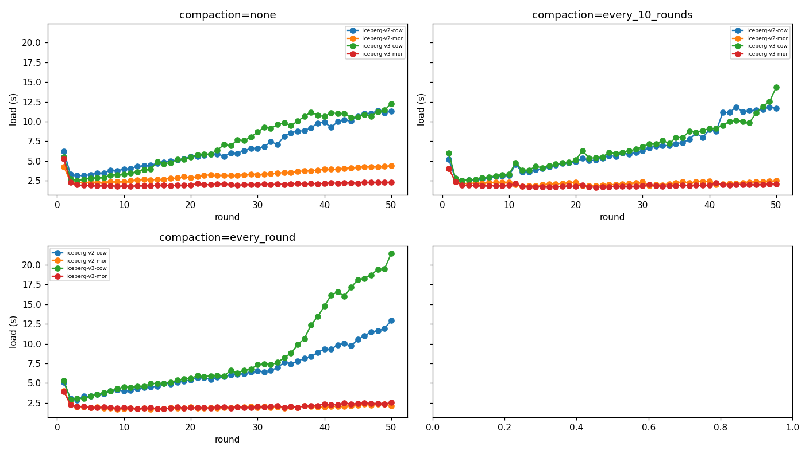

#### 조회 지연 vs 라운드 (패널=compaction · 선=방식)

#### 신선도 write→read vs 라운드 (패널=compaction · 선=방식)

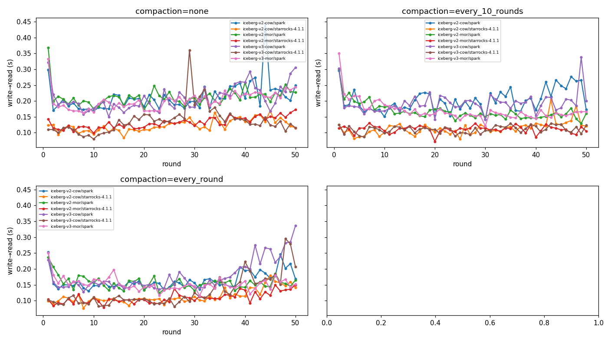

#### compaction 시간 vs 라운드 (패널=compaction · 선=방식)

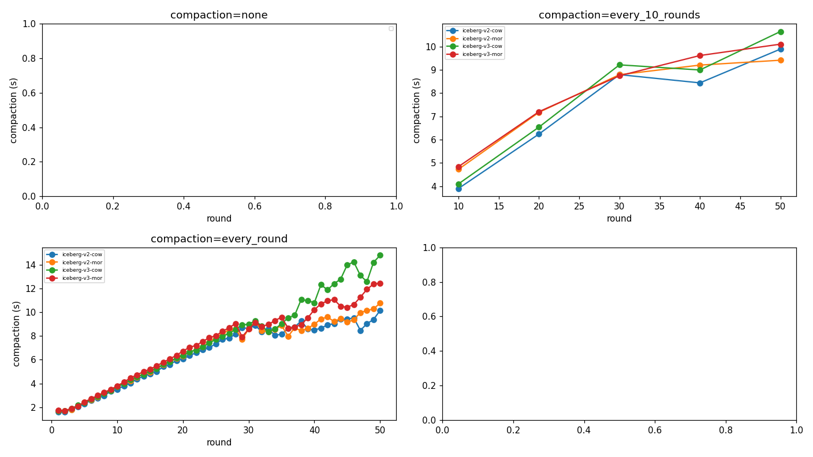

#### 스냅샷 expire+orphan 제거 시간 vs 라운드 (패널=compaction · 선=방식)

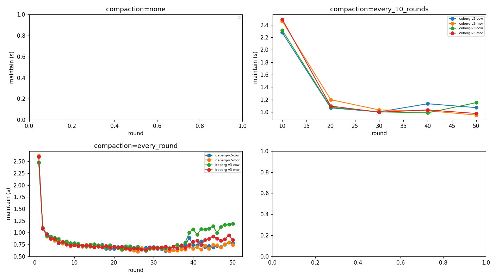

#### 통합 지연(적재+compaction+freshness) vs 라운드 (패널=compaction · 선=방식)

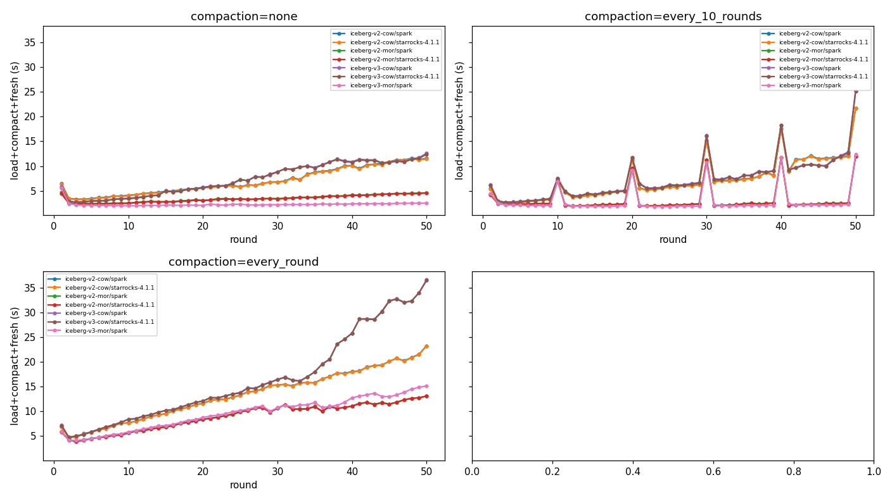

#### 적재→가시성 지연(적재+freshness, compaction 제외) vs 라운드 (패널=compaction · 선=방식)

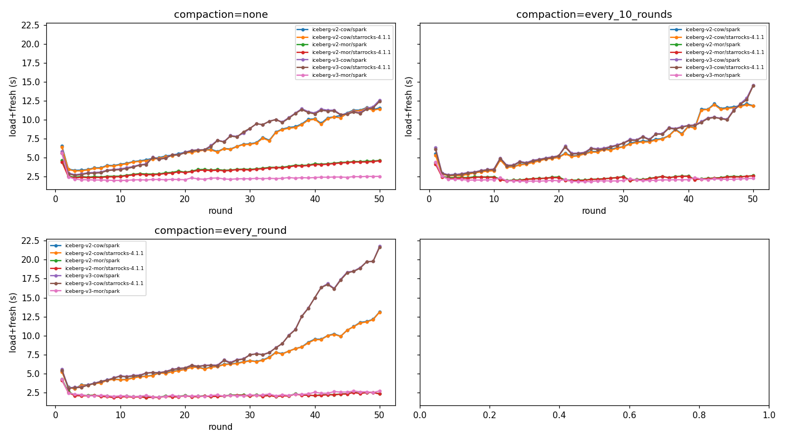

### 9b. 패널=방식 · 선=compaction (각 방식에서 compaction 주기 비교)

#### 적재 시간 vs 라운드 (패널=방식 · 선=compaction)

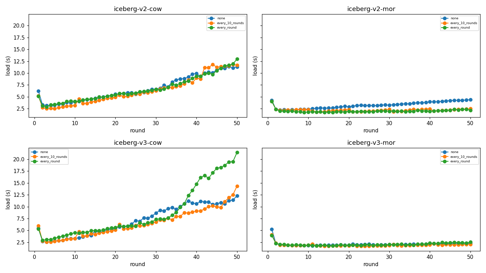

#### 조회 지연 vs 라운드 (패널=방식 · 선=compaction)

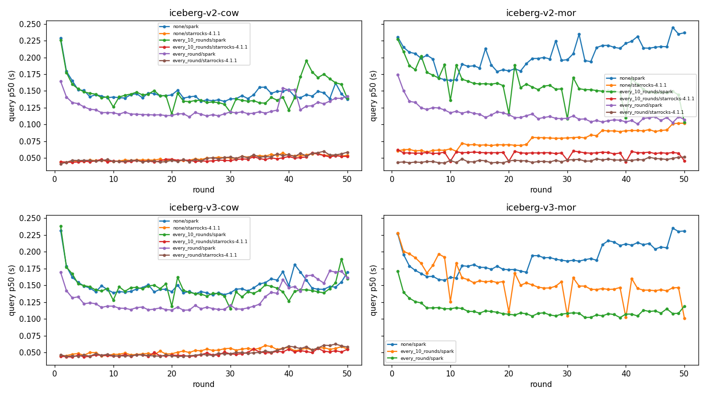

#### 신선도 write→read vs 라운드 (패널=방식 · 선=compaction)

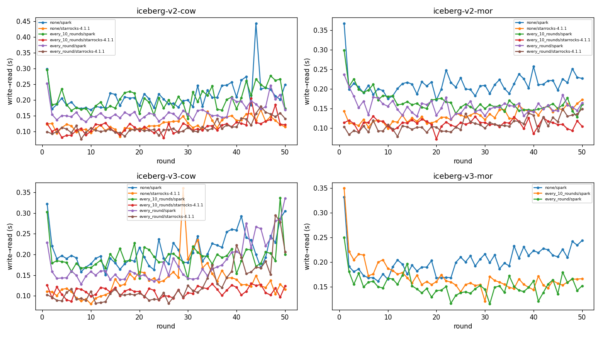

#### compaction 시간 vs 라운드 (패널=방식 · 선=compaction)

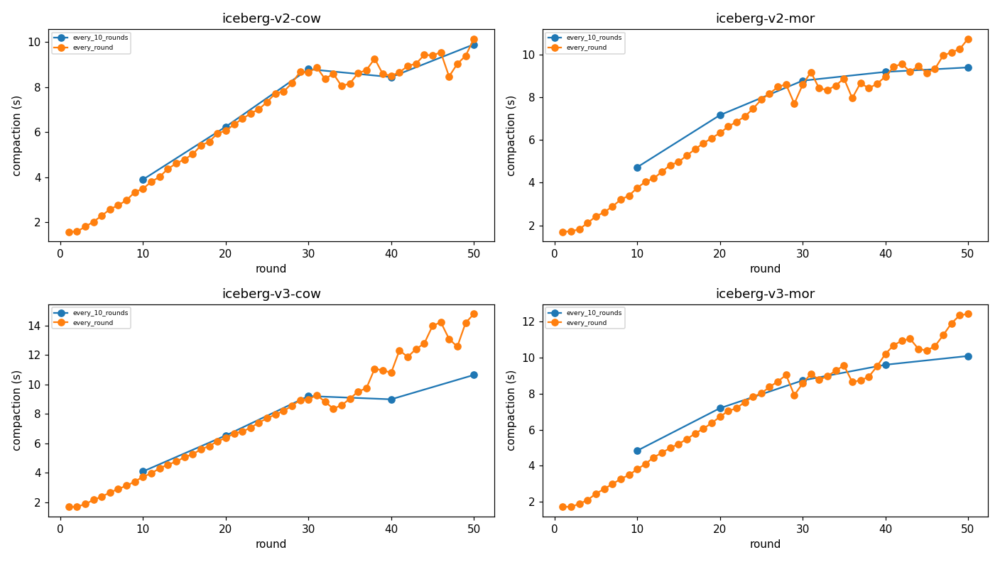

#### 스냅샷 expire+orphan 제거 시간 vs 라운드 (패널=방식 · 선=compaction)

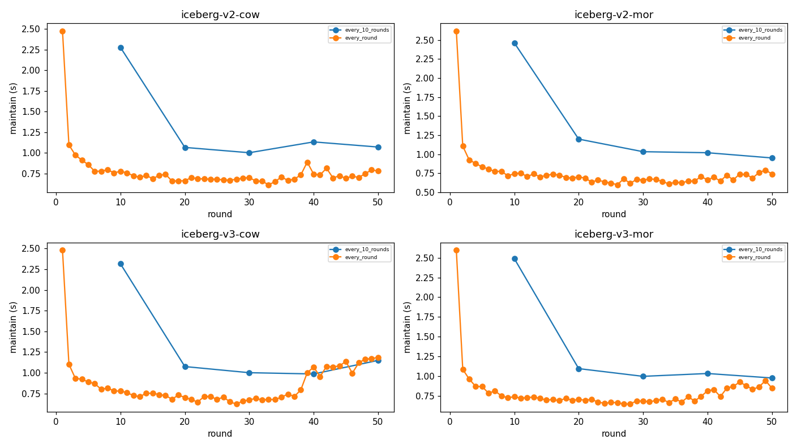

#### 통합 지연(적재+compaction+freshness) vs 라운드 (패널=방식 · 선=compaction)

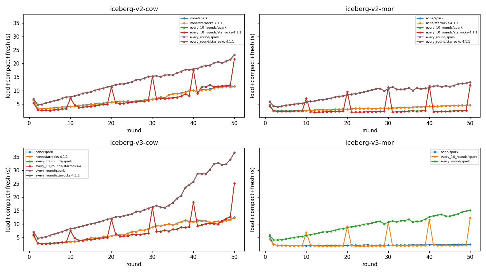

#### 적재→가시성 지연(적재+freshness, compaction 제외) vs 라운드 (패널=방식 · 선=compaction)

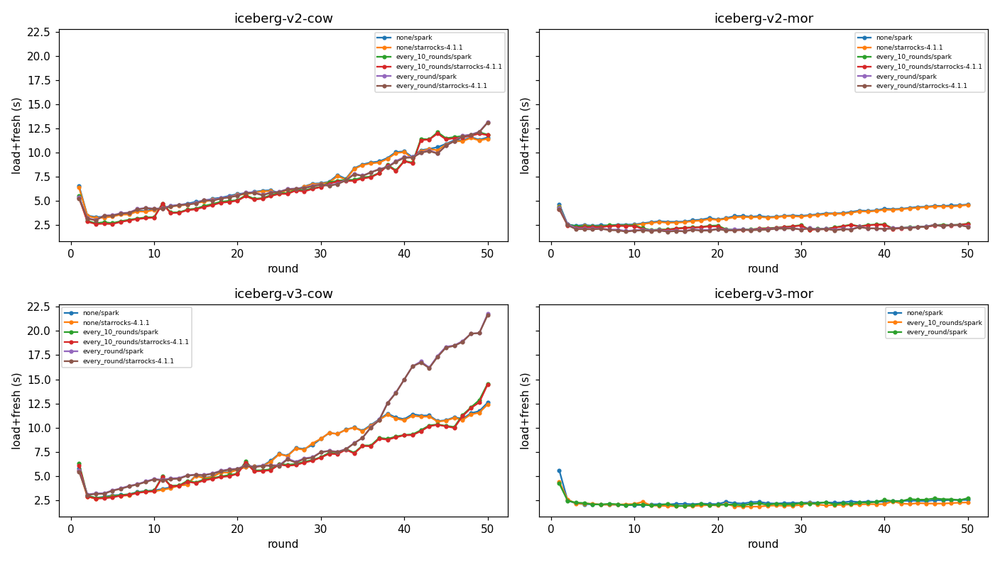

## 10. 시나리오별 해설

- **iceberg-v2-cow**: 적재 6.2s→11.3s (증가(테이블 성장 비례, COW 특성)). compaction 평균 6.5s. StarRocks 호환: none=✓, every_10_rounds=✓, every_round=✓. StarRocks 조회 p50 0.050s. Spark freshness 0.212s.
- **iceberg-v2-mor**: 적재 4.3s→4.4s (평탄(MOR 특성)). compaction 평균 6.8s. StarRocks 호환: none=✓, every_10_rounds=✓, every_round=✓. StarRocks 조회 p50 0.078s. Spark freshness 0.213s.
- **iceberg-v3-cow**: 적재 5.5s→12.3s (증가(테이블 성장 비례, COW 특성)). compaction 평균 7.7s. StarRocks 호환: none=✓, every_10_rounds=✓, every_round=✓. StarRocks 조회 p50 0.052s. Spark freshness 0.209s.
- **iceberg-v3-mor**: 적재 5.2s→2.3s (평탄(MOR 특성)). compaction 평균 7.3s. StarRocks 호환: none=✗, every_10_rounds=✗, every_round=✗. Spark freshness 0.202s.

## 11. 종합 해설

- **v3-MOR × starrocks-4.1.1** compaction별 호환성: none=✗, every_10_rounds=✗, every_round=✗ → deletion vector를 compaction으로 제거해야 StarRocks가 읽을 수 있음.
- **spark** 최저 조회 지연: `iceberg-v3-mor` / every_round (0.112s)
- **starrocks-4.1.1** 최저 조회 지연: `iceberg-v2-mor` / every_round (0.046s)

### 결론 — freshness · write/read 확보에 좋은 구성

- **적재(write) 최저**: `v3-MOR` / every_10_rounds (1.926s) — MOR 계열이 평탄·저비용.
- **조회(read) 최저 p50**: `v3-MOR` / every_round (0.112s).
- **freshness 최저**: `v3-MOR` / every_round (0.153s).
- **균형 종합 권장**: `v3-MOR` / `every_round` (정규화 점수 1.03, 1.0=모든 지표 최저) — 적재·freshness·조회를 동일 가중으로 합산한 최적. 실시간·쓰기빈번(적재→조회 지연 최소화) 워크로드 기준.
