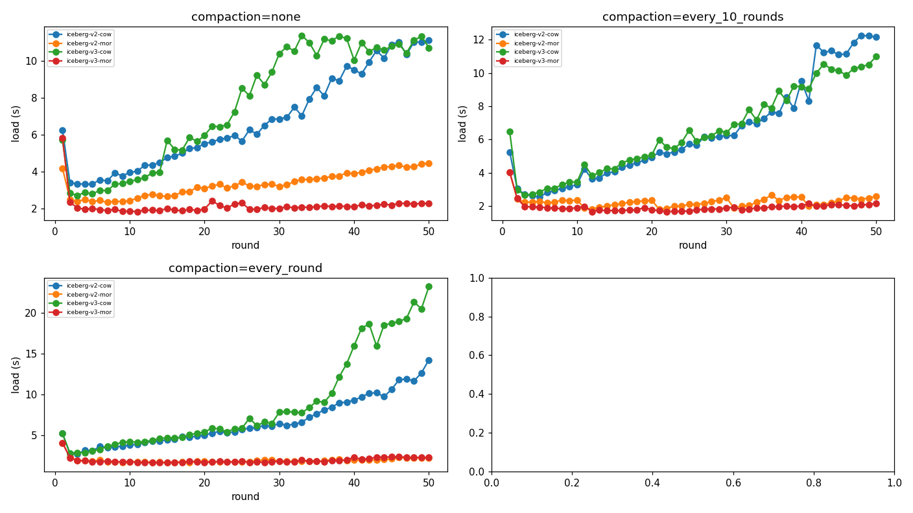
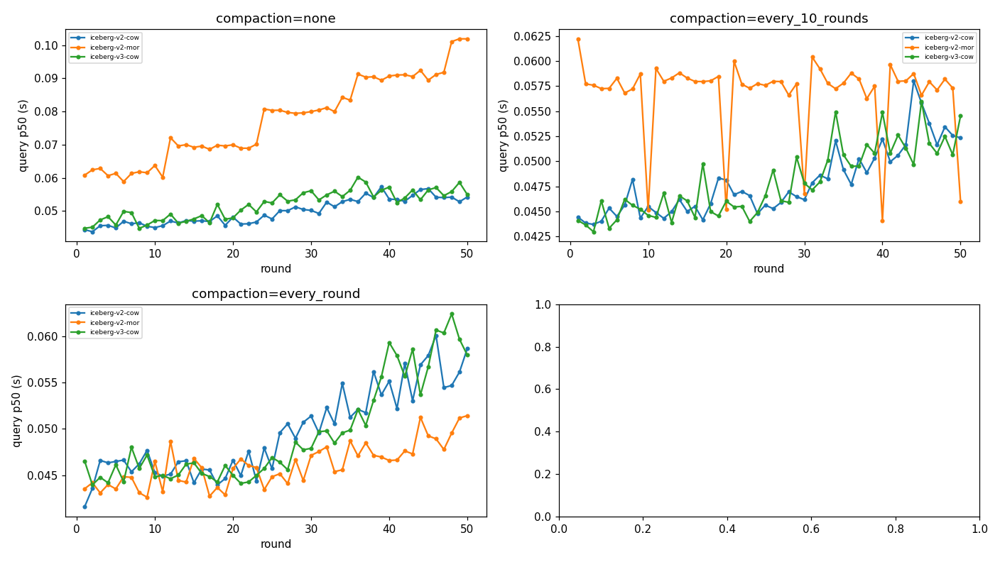
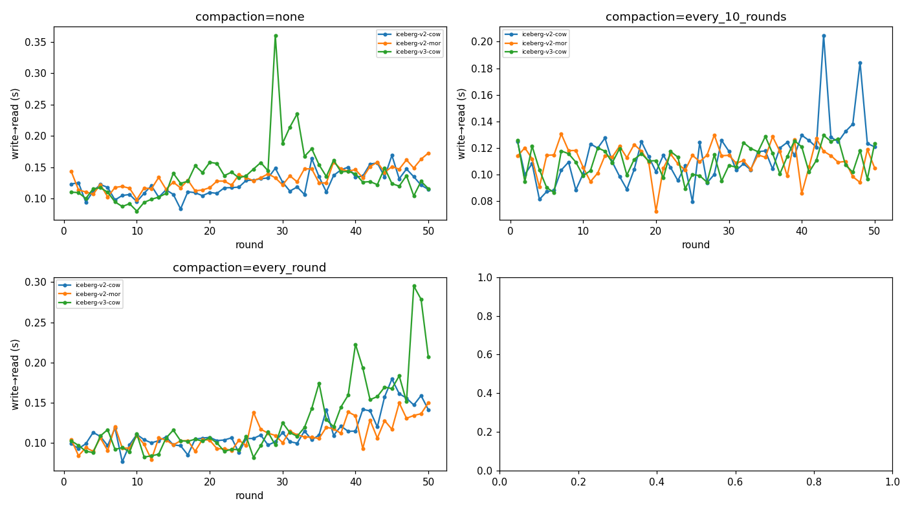
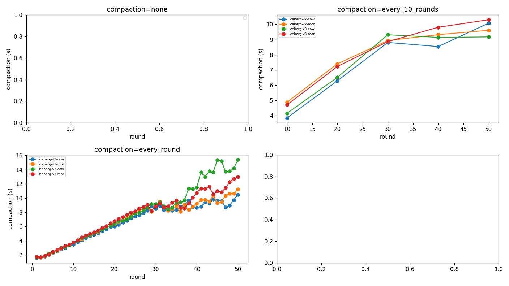
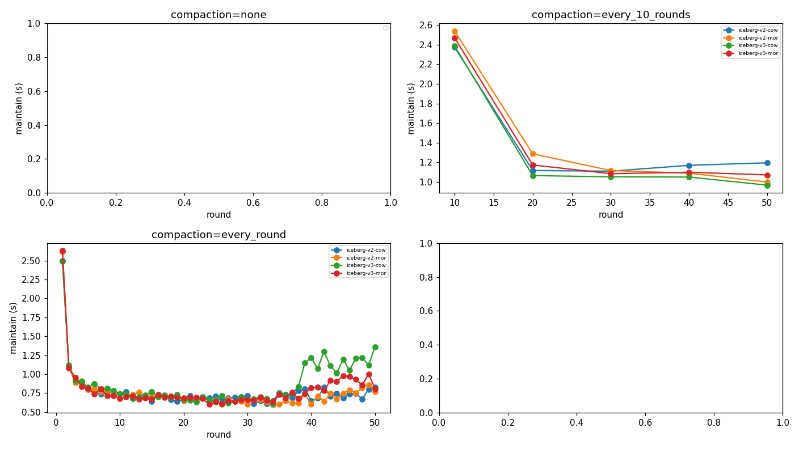
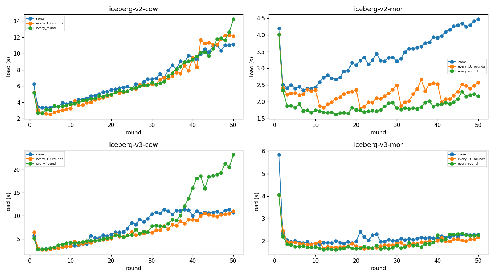
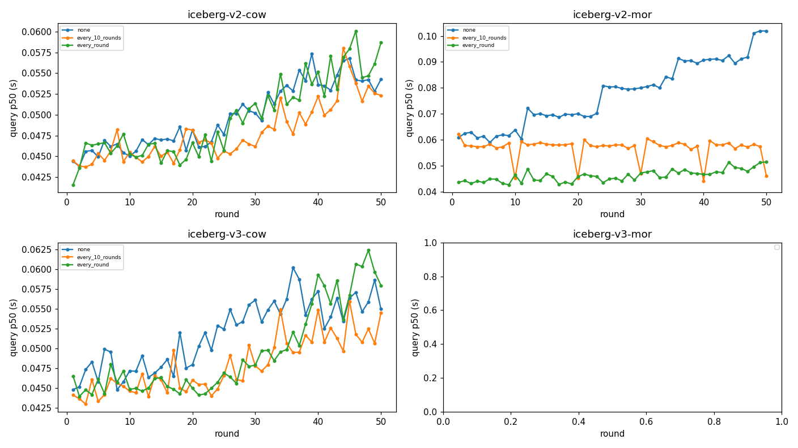
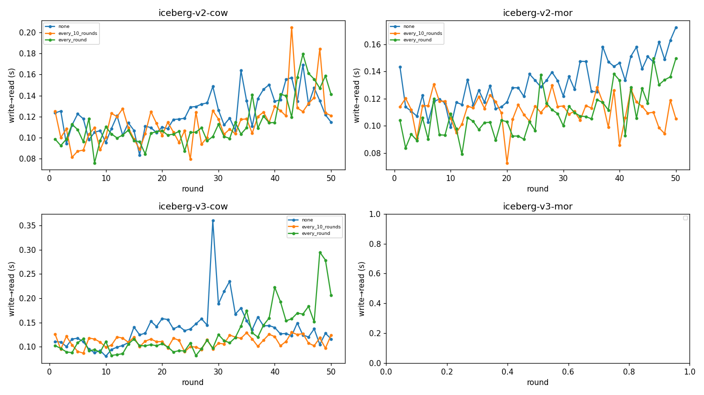
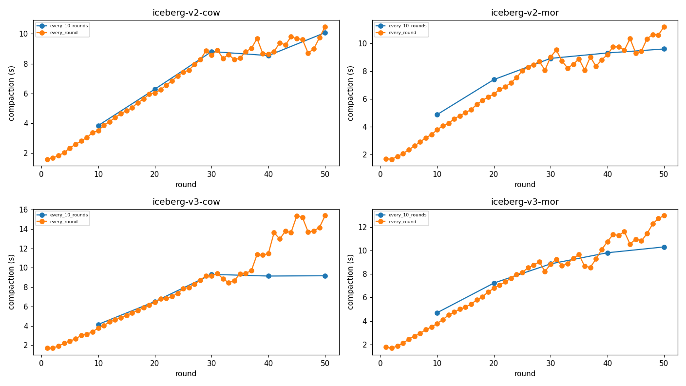
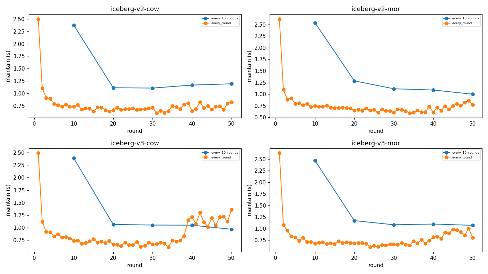

# table-bench-mark 결과 리포트

결과 디렉터리: `avg-sr-3run-20260620-235831` · 라운드 수: 50 · 압축: zstd(Parquet)

## 0. 방법론 · 지표 정의

- **목적**: 쓰기가 빈번한 워크로드에서 Iceberg 구성별 **적재→조회 지연**을 공정하게 비교.
- **적재 엔진** = Apache Spark(`MERGE INTO` 업서트), **조회 엔진** = 설정된 `read_engines`(현재 Spark; StarRocks 옵션). 카탈로그 = Polaris(REST), 스토리지 = MinIO(S3).
- **시나리오** = Iceberg 포맷버전(v2/v3) × 쓰기모드(COW/MOR). **compaction 모드** = none / every_10_rounds / every_round (Spark `rewrite_data_files`, MOR의 deletion vector·delete를 데이터파일에 흡수).
- **시나리오당 흐름**: 초기 시드 후 매 라운드 10만 행 업서트(신규 80% + 기존 PK 20% 갱신) → compaction(주기 해당 시) → 각 엔진이 최근 2회차(~20만 행) 조회.
- **지표**:
  - `적재(load)` = staging→테이블 1라운드 쓰기 시간(Spark).
  - `compaction` = rewrite_data_files 1회 시간(Spark).
  - `maintain` = compaction마다 스냅샷 1개만 남기고(expire) orphan 파일 제거하는 시간(별도 추적).
  - `freshness(write→read)` = **커밋 직후 최신 round_id가 조회에 보일 때까지의 지연** (경량 가시성 프로브 폴링; 못 읽으면 실패). 한 write당 1회 측정이라 라운드별 잡음은 정상 — **분포(median/IQR/p95)** 로 해석.
  - `조회(query)` = 가시화 이후 정상상태 조회 지연(반복 측정 p50).
- **공정성·정밀도**: 랜덤 데이터는 사전 시드 Parquet으로 1회 생성(측정 제외)·동일 바이트, Polaris 메타데이터 캐시 비활성, 후보마다 새 테이블(격리), **측정 직전 정착(settle, 타이머 밖)**, 컨테이너 자원 캡 + Docker VM 사이징으로 스왑/경합 차단. **신뢰도**는 전체 매트릭스 **N회 반복·평균**(run 간 평균·변동성)으로 확보.
- **비교 관점**: compaction 정책별 패널에서 방식 비교 + 쌍대(COW vs MOR / v2-MOR vs v3-MOR / v2-COW vs v3-COW).

## 1. 호환성 매트릭스 (✓ 정상 / △ 부분 / ✗ 불가 / - 없음)

| 시나리오           | compaction      | starrocks-4.1.1   |
|----------------|-----------------|-------------------|
| iceberg-v2-cow | none            | ✓                 |
| iceberg-v2-cow | every_10_rounds | ✓                 |
| iceberg-v2-cow | every_round     | ✓                 |
| iceberg-v2-mor | none            | ✓                 |
| iceberg-v2-mor | every_10_rounds | ✓                 |
| iceberg-v2-mor | every_round     | ✓                 |
| iceberg-v3-cow | none            | ✓                 |
| iceberg-v3-cow | every_10_rounds | ✓                 |
| iceberg-v3-cow | every_round     | ✓                 |
| iceberg-v3-mor | none            | ✗                 |
| iceberg-v3-mor | every_10_rounds | ✗                 |
| iceberg-v3-mor | every_round     | ✗                 |

## 2. 조회 지연 (정상상태 p50 평균, 초)

| 시나리오           | compaction      | starrocks-4.1.1   |
|----------------|-----------------|-------------------|
| iceberg-v2-cow | none            | 0.050             |
| iceberg-v2-cow | every_10_rounds | 0.048             |
| iceberg-v2-cow | every_round     | 0.050             |
| iceberg-v2-mor | none            | 0.078             |
| iceberg-v2-mor | every_10_rounds | 0.057             |
| iceberg-v2-mor | every_round     | 0.046             |
| iceberg-v3-cow | none            | 0.052             |
| iceberg-v3-cow | every_10_rounds | 0.048             |
| iceberg-v3-cow | every_round     | 0.049             |
| iceberg-v3-mor | none            | —                 |
| iceberg-v3-mor | every_10_rounds | —                 |
| iceberg-v3-mor | every_round     | —                 |

## 3. 신선도 write→read (커밋→조회가능 지연 평균, 초)

| 시나리오           | compaction      | starrocks-4.1.1   |
|----------------|-----------------|-------------------|
| iceberg-v2-cow | none            | 0.123             |
| iceberg-v2-cow | every_10_rounds | 0.114             |
| iceberg-v2-cow | every_round     | 0.113             |
| iceberg-v2-mor | none            | 0.132             |
| iceberg-v2-mor | every_10_rounds | 0.111             |
| iceberg-v2-mor | every_round     | 0.109             |
| iceberg-v3-cow | none            | 0.138             |
| iceberg-v3-cow | every_10_rounds | 0.111             |
| iceberg-v3-cow | every_round     | 0.127             |
| iceberg-v3-mor | none            | —                 |
| iceberg-v3-mor | every_10_rounds | —                 |
| iceberg-v3-mor | every_round     | —                 |

## 4. 적재 · compaction · maintain(스냅샷 expire+orphan) 비용 (초)

| 시나리오           | compaction      |   적재 평균(s) | compaction 평균(s)   |   compaction 총합(s) | maintain 평균(s)   |   maintain 총합(s) |
|----------------|-----------------|------------|--------------------|--------------------|------------------|------------------|
| iceberg-v2-cow | none            |      6.736 | —                  |                0   | —                |              0   |
| iceberg-v2-cow | every_10_rounds |      6.397 | 7.512              |               37.6 | 1.393            |              7   |
| iceberg-v2-cow | every_round     |      6.548 | 6.639              |              331.9 | 0.764            |             38.2 |
| iceberg-v2-mor | none            |      3.324 | —                  |                0   | —                |              0   |
| iceberg-v2-mor | every_10_rounds |      2.259 | 8.030              |               40.1 | 1.406            |              7   |
| iceberg-v2-mor | every_round     |      1.903 | 6.900              |              345   | 0.752            |             37.6 |
| iceberg-v3-cow | none            |      7.605 | —                  |                0   | —                |              0   |
| iceberg-v3-cow | every_10_rounds |      6.437 | 7.660              |               38.3 | 1.304            |              6.5 |
| iceberg-v3-cow | every_round     |      8.811 | 7.945              |              397.2 | 0.876            |             43.8 |
| iceberg-v3-mor | none            |      2.16  | —                  |                0   | —                |              0   |
| iceberg-v3-mor | every_10_rounds |      1.937 | 8.184              |               40.9 | 1.379            |              6.9 |
| iceberg-v3-mor | every_round     |      1.906 | 7.420              |              371   | 0.790            |             39.5 |

## 5. compaction 정책별 방식 비교 (각 정책 하에서 v2/v3 × COW/MOR)

> CV(변동계수)는 라운드 간 변동성. freshness 는 단일 콜드 측정이라 CV 가 query 보다 큼(정상).

### compaction = `none`

| 방식     |   적재(s) | freshness(s)   | fresh CV   | 조회 p50(s)   | 조회 CV   |
|--------|---------|----------------|------------|-------------|---------|
| v2-COW |   6.736 | 0.123          | 15%        | 0.050       | 8%      |
| v2-MOR |   3.324 | 0.132          | 13%        | 0.078       | 16%     |
| v3-COW |   7.605 | 0.138          | 32%        | 0.052       | 8%      |
| v3-MOR |   2.16  | —              | —          | —           | —       |

### compaction = `every_10_rounds`

| 방식     |   적재(s) | freshness(s)   | fresh CV   | 조회 p50(s)   | 조회 CV   |
|--------|---------|----------------|------------|-------------|---------|
| v2-COW |   6.397 | 0.114          | 19%        | 0.048       | 7%      |
| v2-MOR |   2.259 | 0.111          | 10%        | 0.057       | 7%      |
| v3-COW |   6.437 | 0.111          | 10%        | 0.048       | 7%      |
| v3-MOR |   1.937 | —              | —          | —           | —       |

### compaction = `every_round`

| 방식     |   적재(s) | freshness(s)   | fresh CV   | 조회 p50(s)   | 조회 CV   |
|--------|---------|----------------|------------|-------------|---------|
| v2-COW |   6.548 | 0.113          | 19%        | 0.050       | 9%      |
| v2-MOR |   1.903 | 0.109          | 15%        | 0.046       | 5%      |
| v3-COW |   8.811 | 0.127          | 37%        | 0.049       | 11%     |
| v3-MOR |   1.906 | —              | —          | —           | —       |

## 6. 쌍대 비교 (COW vs MOR · v2 vs v3)

### COW vs MOR (v2) — 비율 = v2-MOR ÷ v2-COW (＜1 이면 v2-MOR 가 더 낮음)

| compaction      |   적재 v2-COW |   적재 v2-MOR | 비율    |   fresh v2-COW |   fresh v2-MOR | 비율    |   조회 v2-COW |   조회 v2-MOR | 비율    |
|-----------------|-------------|-------------|-------|----------------|----------------|-------|-------------|-------------|-------|
| none            |       6.736 |       3.324 | 0.49× |          0.123 |          0.132 | 1.07× |       0.05  |       0.078 | 1.56× |
| every_10_rounds |       6.397 |       2.259 | 0.35× |          0.114 |          0.111 | 0.97× |       0.048 |       0.057 | 1.19× |
| every_round     |       6.548 |       1.903 | 0.29× |          0.113 |          0.109 | 0.96× |       0.05  |       0.046 | 0.93× |

### COW vs MOR (v3) — 비율 = v3-MOR ÷ v3-COW (＜1 이면 v3-MOR 가 더 낮음)

| compaction      |   적재 v3-COW |   적재 v3-MOR | 비율    |   fresh v3-COW | fresh v3-MOR   | 비율   |   조회 v3-COW | 조회 v3-MOR   | 비율   |
|-----------------|-------------|-------------|-------|----------------|----------------|------|-------------|-------------|------|
| none            |       7.605 |       2.16  | 0.28× |          0.138 | —              | —    |       0.052 | —           | —    |
| every_10_rounds |       6.437 |       1.937 | 0.30× |          0.111 | —              | —    |       0.048 | —           | —    |
| every_round     |       8.811 |       1.906 | 0.22× |          0.127 | —              | —    |       0.049 | —           | —    |

### v2-MOR vs v3-MOR — 비율 = v3-MOR ÷ v2-MOR (＜1 이면 v3-MOR 가 더 낮음)

| compaction      |   적재 v2-MOR |   적재 v3-MOR | 비율    |   fresh v2-MOR | fresh v3-MOR   | 비율   |   조회 v2-MOR | 조회 v3-MOR   | 비율   |
|-----------------|-------------|-------------|-------|----------------|----------------|------|-------------|-------------|------|
| none            |       3.324 |       2.16  | 0.65× |          0.132 | —              | —    |       0.078 | —           | —    |
| every_10_rounds |       2.259 |       1.937 | 0.86× |          0.111 | —              | —    |       0.057 | —           | —    |
| every_round     |       1.903 |       1.906 | 1.00× |          0.109 | —              | —    |       0.046 | —           | —    |

### v2-COW vs v3-COW — 비율 = v3-COW ÷ v2-COW (＜1 이면 v3-COW 가 더 낮음)

| compaction      |   적재 v2-COW |   적재 v3-COW | 비율    |   fresh v2-COW |   fresh v3-COW | 비율    |   조회 v2-COW |   조회 v3-COW | 비율    |
|-----------------|-------------|-------------|-------|----------------|----------------|-------|-------------|-------------|-------|
| none            |       6.736 |       7.605 | 1.13× |          0.123 |          0.138 | 1.12× |       0.05  |       0.052 | 1.04× |
| every_10_rounds |       6.397 |       6.437 | 1.01× |          0.114 |          0.111 | 0.97× |       0.048 |       0.048 | 1.00× |
| every_round     |       6.548 |       8.811 | 1.35× |          0.113 |          0.127 | 1.12× |       0.05  |       0.049 | 1.00× |

## 7. 기술 배경 · 수치 해석 (메커니즘)

> 개념: COW(데이터파일 전체 재작성) · MOR(삭제표식 추가; v2 positional delete / v3 deletion vector) · compaction(small file 병합 + 삭제 흡수) · snapshot(커밋 단위, maintain이 expire) · row-lineage(v3 행 메타데이터).

- **COW vs MOR 쓰기 메커니즘**: COW(copy-on-write)는 `MERGE` 시 갱신 행이 포함된 **데이터 파일을 통째로 다시 씁니다**. 그래서 쓰기 비용이 테이블 크기·파일 수에 비례해 커집니다. MOR(merge-on-read)은 데이터 파일을 안 건드리고 **삭제 표식만 추가**합니다 — v2는 *positional delete 파일*, v3는 *deletion vector*(데이터 파일당 Roaring 비트맵 1개). 그래서 MOR 적재는 평탄·저비용입니다. 실측 적재(none): MOR 2.74s vs COW 7.17s (MOR이 COW의 0.38배).

- **small file·snapshot·compaction**: 매 라운드 커밋은 새 데이터/삭제 파일과 **snapshot 1개**를 만들어 작은 파일이 누적됩니다. `compaction`(`rewrite_data_files`)은 small file을 큰 파일로 병합하고 삭제(deletion vector/positional delete)를 데이터에 **흡수**합니다 → 파일 수↓, 읽기·freshness 개선. 대신 쓰기 비용이 추가됩니다. 실측 compaction 총비용: every_round ≈ 361s vs every_10 ≈ 39s. `maintain`은 snapshot을 1개만 남기고(expire) orphan 파일을 제거해 메타데이터 팽창을 막습니다.

- **주기(compaction cadence)의 양면성**: `none`은 쓰기는 싸지만 파일·삭제가 쌓여 읽기 플래닝이 무거워질 수 있습니다. `every_round`는 매 라운드 파일을 정리해 읽기/freshness가 가장 좋지만, **COW에서는 정리된 소수 대형 파일을 다음 MERGE가 거의 전체 재작성**하게 만들어 후반 적재가 급증합니다. 실측 every_round 적재 최종라운드: v3-COW 23.23s vs v2-COW 14.23s (v3/v2 ≈ 1.63배) — v3 row-lineage 오버헤드가 전체 재작성에서 드러남.

- **MOR 읽기와 compaction**: MOR은 조회 시 삭제 표식을 실시간 병합하므로 compaction 전에는 읽기가 느릴 수 있습니다(특히 v2 positional delete는 여러 작은 삭제 파일을 reconcile). compaction이 삭제를 흡수하면 COW급으로 빨라집니다. 실측 MOR 조회: none 0.078s → every_round 0.046s.

- **v2 vs v3**: v3는 deletion vector로 MOR 읽기가 v2(positional delete)보다 유리하고 삭제가 쌓여도 데이터 파일당 비트맵 1개라 성능이 덜 악화됩니다. 단 v3는 행마다 **row-lineage**(`_row_id`,`_last_updated_sequence_number`)를 의무적으로 유지하며 이는 **끌 수 없습니다**. 계측 결과(v2 vs v3-COW, every_round): 재작성 **행수·파일수·바이트는 동일**(행당 +0.6%)인데 **적재 시간만 R40부터 1.5~1.9× 더 큼** → 즉 쓰기량(I/O)이 아니라 **per-row 연산(row-lineage 유지) 오버헤드**가, 테이블 전체를 매라운드 재작성하는 구간에서 갑자기 드러나는 것(전체 재작성 행수가 임계에 도달하며 발생하는 계단형 비용).

- **freshness 해석**: freshness는 *쓰기→가시성 지연*으로, 본질적으로 새 snapshot의 메타데이터 플래닝 비용에 가깝습니다(데이터 본문 읽기는 제외한 경량 프로브). Spark는 자기 커밋을 즉시 보고, StarRocks는 메타캐시 비활성이라 측정에 `REFRESH EXTERNAL TABLE`이 포함됩니다 — 엔진 간 freshness는 정의가 다소 다릅니다.

## 9. 그래프

### 9a. 패널=compaction · 선=방식 (각 compaction 정책에서 v2/v3×COW/MOR 비교)

#### 적재 시간 vs 라운드 (패널=compaction · 선=방식)

#### 조회 지연 vs 라운드 (패널=compaction · 선=방식)

#### 신선도 write→read vs 라운드 (패널=compaction · 선=방식)

#### compaction 시간 vs 라운드 (패널=compaction · 선=방식)

#### 스냅샷 expire+orphan 제거 시간 vs 라운드 (패널=compaction · 선=방식)

### 9b. 패널=방식 · 선=compaction (각 방식에서 compaction 주기 비교)

#### 적재 시간 vs 라운드 (패널=방식 · 선=compaction)

#### 조회 지연 vs 라운드 (패널=방식 · 선=compaction)

#### 신선도 write→read vs 라운드 (패널=방식 · 선=compaction)

#### compaction 시간 vs 라운드 (패널=방식 · 선=compaction)

#### 스냅샷 expire+orphan 제거 시간 vs 라운드 (패널=방식 · 선=compaction)

## 10. 시나리오별 해설

- **iceberg-v2-cow**: 적재 6.3s→11.1s (증가(테이블 성장 비례, COW 특성)). compaction 평균 6.6s. StarRocks 호환: none=✓, every_10_rounds=✓, every_round=✓. StarRocks 조회 p50 0.050s.
- **iceberg-v2-mor**: 적재 4.2s→4.5s (평탄(MOR 특성)). compaction 평균 6.9s. StarRocks 호환: none=✓, every_10_rounds=✓, every_round=✓. StarRocks 조회 p50 0.078s.
- **iceberg-v3-cow**: 적재 5.7s→10.7s (증가(테이블 성장 비례, COW 특성)). compaction 평균 7.9s. StarRocks 호환: none=✓, every_10_rounds=✓, every_round=✓. StarRocks 조회 p50 0.052s.
- **iceberg-v3-mor**: 적재 5.8s→2.3s (평탄(MOR 특성)). compaction 평균 7.4s. StarRocks 호환: none=✗, every_10_rounds=✗, every_round=✗.

## 11. 종합 해설

- **v3-MOR × starrocks-4.1.1** compaction별 호환성: none=✗, every_10_rounds=✗, every_round=✗ → deletion vector를 compaction으로 제거해야 StarRocks가 읽을 수 있음.
- **starrocks-4.1.1** 최저 조회 지연: `iceberg-v2-mor` / every_round (0.046s)

### 결론 — freshness · write/read 확보에 좋은 구성

- **적재(write) 최저**: `v2-MOR` / every_round (1.903s) — MOR 계열이 평탄·저비용.
- **조회(read) 최저 p50**: `v2-MOR` / every_round (0.046s).
- **freshness 최저**: `v2-MOR` / every_round (0.109s).
- **균형 종합 권장**: `v2-MOR` / `every_round` (정규화 점수 1.00, 1.0=모든 지표 최저) — 적재·freshness·조회를 동일 가중으로 합산한 최적. 실시간·쓰기빈번(적재→조회 지연 최소화) 워크로드 기준.
