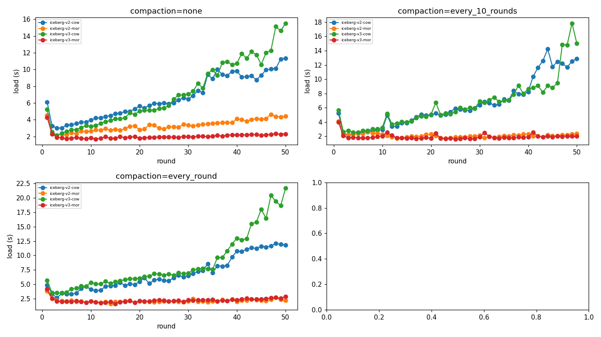
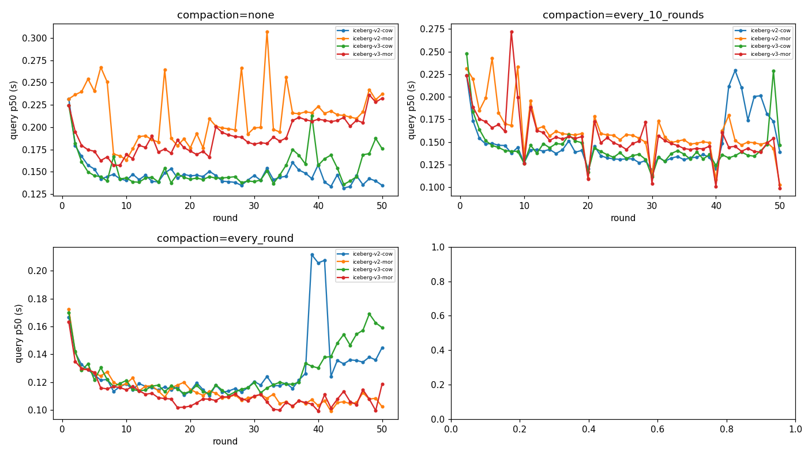
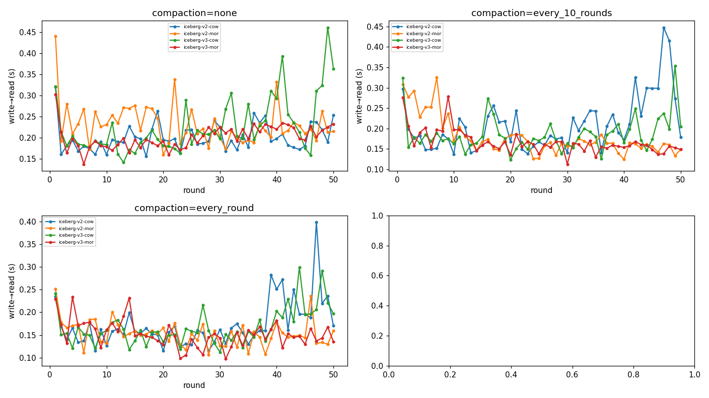
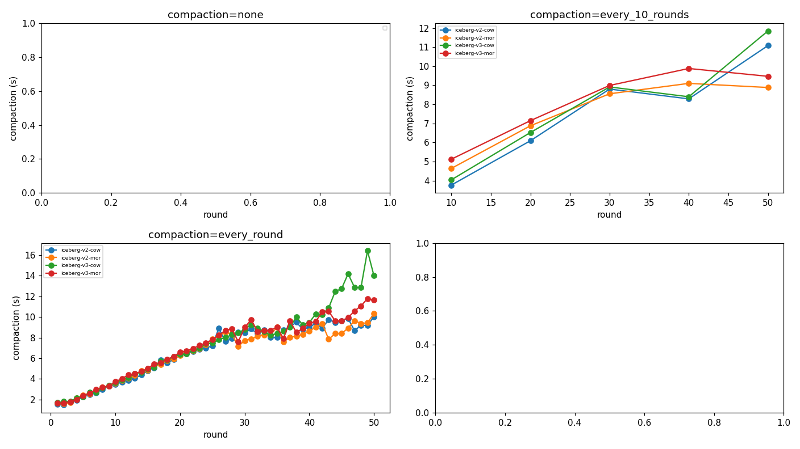
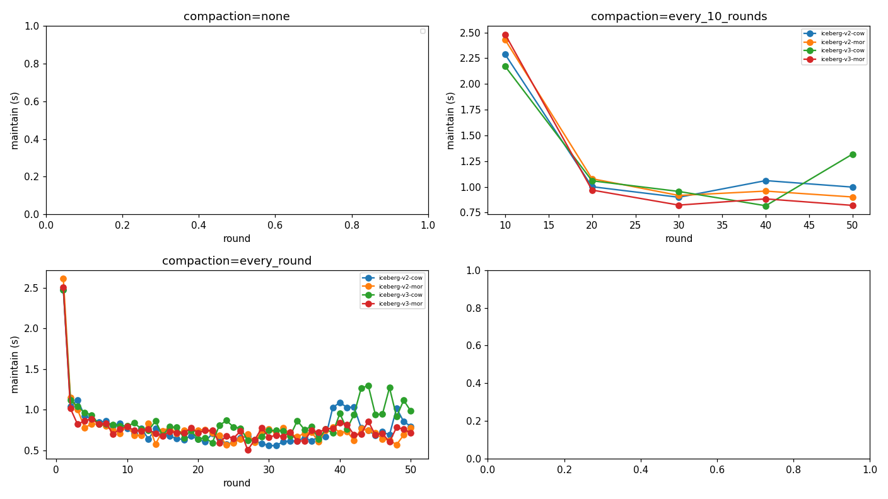

# table-bench-mark 결과 리포트

결과 디렉터리: `bench-20260619-211042` · 라운드 수: 50 · 압축: zstd(Parquet)

## 0. 방법론 · 지표 정의

- **목적**: 쓰기가 빈번한 워크로드에서 Iceberg 구성별 **적재→조회 지연**을 공정하게 비교.
- **적재 엔진** = Apache Spark(`MERGE INTO` 업서트), **조회 엔진** = 설정된 `read_engines`(현재 Spark; StarRocks 옵션). 카탈로그 = Polaris(REST), 스토리지 = MinIO(S3).
- **시나리오** = Iceberg 포맷버전(v2/v3) × 쓰기모드(COW/MOR). **compaction 모드** = none / every_10_rounds / every_round (Spark `rewrite_data_files`, MOR의 deletion vector·delete를 데이터파일에 흡수).
- **시나리오당 흐름**: 초기 시드 후 매 라운드 10만 행 업서트(신규 80% + 기존 PK 20% 갱신) → compaction(주기 해당 시) → 각 엔진이 최근 2회차(~20만 행) 조회.
- **지표**:
  - `적재(load)` = staging→테이블 1라운드 쓰기 시간(Spark).
  - `compaction` = rewrite_data_files 1회 시간(Spark).
  - `maintain` = compaction마다 스냅샷 1개만 남기고(expire) orphan 파일 제거하는 시간(별도 추적).
  - `freshness(write→read)` = **커밋 직후 최신 round_id가 조회에 보일 때까지의 지연** (경량 가시성 프로브 폴링; 못 읽으면 실패). 한 write당 1회 측정이라 라운드별 잡음은 정상 — **분포(median/IQR/p95)** 로 해석.
  - `조회(query)` = 가시화 이후 정상상태 조회 지연(반복 측정 p50).
- **공정성·정밀도**: 랜덤 데이터는 사전 시드 Parquet으로 1회 생성(측정 제외)·동일 바이트, Polaris 메타데이터 캐시 비활성, 후보마다 새 테이블(격리), **측정 직전 정착(settle, 타이머 밖)**, 컨테이너 자원 캡 + Docker VM 사이징으로 스왑/경합 차단. **신뢰도**는 전체 매트릭스 **N회 반복·평균**(run 간 평균·변동성)으로 확보.
- **비교 관점**: compaction 정책별 패널에서 방식 비교 + 쌍대(COW vs MOR / v2-MOR vs v3-MOR / v2-COW vs v3-COW).

## 1. 호환성 매트릭스 (✓ 정상 / △ 부분 / ✗ 불가 / - 없음)

| 시나리오           | compaction      | spark   |
|----------------|-----------------|---------|
| iceberg-v2-cow | none            | ✓       |
| iceberg-v2-cow | every_10_rounds | ✓       |
| iceberg-v2-cow | every_round     | ✓       |
| iceberg-v2-mor | none            | ✓       |
| iceberg-v2-mor | every_10_rounds | ✓       |
| iceberg-v2-mor | every_round     | ✓       |
| iceberg-v3-cow | none            | ✓       |
| iceberg-v3-cow | every_10_rounds | ✓       |
| iceberg-v3-cow | every_round     | ✓       |
| iceberg-v3-mor | none            | ✓       |
| iceberg-v3-mor | every_10_rounds | ✓       |
| iceberg-v3-mor | every_round     | ✓       |

## 2. 조회 지연 (정상상태 p50 평균, 초)

| 시나리오           | compaction      |   spark |
|----------------|-----------------|---------|
| iceberg-v2-cow | none            |   0.147 |
| iceberg-v2-cow | every_10_rounds |   0.149 |
| iceberg-v2-cow | every_round     |   0.128 |
| iceberg-v2-mor | none            |   0.212 |
| iceberg-v2-mor | every_10_rounds |   0.161 |
| iceberg-v2-mor | every_round     |   0.114 |
| iceberg-v3-cow | none            |   0.153 |
| iceberg-v3-cow | every_10_rounds |   0.144 |
| iceberg-v3-cow | every_round     |   0.127 |
| iceberg-v3-mor | none            |   0.189 |
| iceberg-v3-mor | every_10_rounds |   0.155 |
| iceberg-v3-mor | every_round     |   0.111 |

## 3. 신선도 write→read (커밋→조회가능 지연 평균, 초)

| 시나리오           | compaction      |   spark |
|----------------|-----------------|---------|
| iceberg-v2-cow | none            |   0.201 |
| iceberg-v2-cow | every_10_rounds |   0.21  |
| iceberg-v2-cow | every_round     |   0.172 |
| iceberg-v2-mor | none            |   0.231 |
| iceberg-v2-mor | every_10_rounds |   0.179 |
| iceberg-v2-mor | every_round     |   0.153 |
| iceberg-v3-cow | none            |   0.227 |
| iceberg-v3-cow | every_10_rounds |   0.186 |
| iceberg-v3-cow | every_round     |   0.167 |
| iceberg-v3-mor | none            |   0.201 |
| iceberg-v3-mor | every_10_rounds |   0.167 |
| iceberg-v3-mor | every_round     |   0.152 |

## 4. 적재 · compaction · maintain(스냅샷 expire+orphan) 비용 (초)

| 시나리오           | compaction      |   적재 평균(s) | compaction 평균(s)   |   compaction 총합(s) | maintain 평균(s)   |   maintain 총합(s) |
|----------------|-----------------|------------|--------------------|--------------------|------------------|------------------|
| iceberg-v2-cow | none            |      6.629 | —                  |                0   | —                |              0   |
| iceberg-v2-cow | every_10_rounds |      6.463 | 7.604              |               38   | 1.249            |              6.2 |
| iceberg-v2-cow | every_round     |      6.833 | 6.608              |              330.4 | 0.781            |             39.1 |
| iceberg-v2-mor | none            |      3.284 | —                  |                0   | —                |              0   |
| iceberg-v2-mor | every_10_rounds |      2.143 | 7.609              |               38   | 1.257            |              6.3 |
| iceberg-v2-mor | every_round     |      2.12  | 6.480              |              324   | 0.765            |             38.2 |
| iceberg-v3-cow | none            |      7.063 | —                  |                0   | —                |              0   |
| iceberg-v3-cow | every_10_rounds |      6.496 | 7.943              |               39.7 | 1.264            |              6.3 |
| iceberg-v3-cow | every_round     |      8.605 | 7.397              |              369.9 | 0.866            |             43.3 |
| iceberg-v3-mor | none            |      2.028 | —                  |                0   | —                |              0   |
| iceberg-v3-mor | every_10_rounds |      1.947 | 8.121              |               40.6 | 1.195            |              6   |
| iceberg-v3-mor | every_round     |      2.218 | 7.008              |              350.4 | 0.769            |             38.5 |

## 5. compaction 정책별 방식 비교 (각 정책 하에서 v2/v3 × COW/MOR)

> CV(변동계수)는 라운드 간 변동성. freshness 는 단일 콜드 측정이라 CV 가 query 보다 큼(정상).

### compaction = `none`

| 방식     |   적재(s) |   freshness(s) | fresh CV   |   조회 p50(s) | 조회 CV   |
|--------|---------|----------------|------------|-------------|---------|
| v2-COW |   6.629 |          0.201 | 16%        |       0.147 | 10%     |
| v2-MOR |   3.284 |          0.231 | 21%        |       0.212 | 14%     |
| v3-COW |   7.063 |          0.227 | 29%        |       0.153 | 12%     |
| v3-MOR |   2.028 |          0.201 | 13%        |       0.189 | 10%     |

### compaction = `every_10_rounds`

| 방식     |   적재(s) |   freshness(s) | fresh CV   |   조회 p50(s) | 조회 CV   |
|--------|---------|----------------|------------|-------------|---------|
| v2-COW |   6.463 |          0.21  | 32%        |       0.149 | 18%     |
| v2-MOR |   2.143 |          0.179 | 25%        |       0.161 | 17%     |
| v3-COW |   6.496 |          0.186 | 23%        |       0.144 | 16%     |
| v3-MOR |   1.947 |          0.167 | 18%        |       0.155 | 18%     |

### compaction = `every_round`

| 방식     |   적재(s) |   freshness(s) | fresh CV   |   조회 p50(s) | 조회 CV   |
|--------|---------|----------------|------------|-------------|---------|
| v2-COW |   6.833 |          0.172 | 29%        |       0.128 | 18%     |
| v2-MOR |   2.12  |          0.153 | 18%        |       0.114 | 10%     |
| v3-COW |   8.605 |          0.167 | 24%        |       0.127 | 13%     |
| v3-MOR |   2.218 |          0.152 | 19%        |       0.111 | 10%     |

## 6. 쌍대 비교 (COW vs MOR · v2 vs v3)

### COW vs MOR (v2) — 비율 = v2-MOR ÷ v2-COW (＜1 이면 v2-MOR 가 더 낮음)

| compaction      |   적재 v2-COW |   적재 v2-MOR | 비율    |   fresh v2-COW |   fresh v2-MOR | 비율    |   조회 v2-COW |   조회 v2-MOR | 비율    |
|-----------------|-------------|-------------|-------|----------------|----------------|-------|-------------|-------------|-------|
| none            |       6.629 |       3.284 | 0.50× |          0.201 |          0.231 | 1.15× |       0.147 |       0.212 | 1.45× |
| every_10_rounds |       6.463 |       2.143 | 0.33× |          0.21  |          0.179 | 0.85× |       0.149 |       0.161 | 1.08× |
| every_round     |       6.833 |       2.12  | 0.31× |          0.172 |          0.153 | 0.89× |       0.128 |       0.114 | 0.89× |

### COW vs MOR (v3) — 비율 = v3-MOR ÷ v3-COW (＜1 이면 v3-MOR 가 더 낮음)

| compaction      |   적재 v3-COW |   적재 v3-MOR | 비율    |   fresh v3-COW |   fresh v3-MOR | 비율    |   조회 v3-COW |   조회 v3-MOR | 비율    |
|-----------------|-------------|-------------|-------|----------------|----------------|-------|-------------|-------------|-------|
| none            |       7.063 |       2.028 | 0.29× |          0.227 |          0.201 | 0.89× |       0.153 |       0.189 | 1.24× |
| every_10_rounds |       6.496 |       1.947 | 0.30× |          0.186 |          0.167 | 0.90× |       0.144 |       0.155 | 1.08× |
| every_round     |       8.605 |       2.218 | 0.26× |          0.167 |          0.152 | 0.91× |       0.127 |       0.111 | 0.88× |

### v2-MOR vs v3-MOR — 비율 = v3-MOR ÷ v2-MOR (＜1 이면 v3-MOR 가 더 낮음)

| compaction      |   적재 v2-MOR |   적재 v3-MOR | 비율    |   fresh v2-MOR |   fresh v3-MOR | 비율    |   조회 v2-MOR |   조회 v3-MOR | 비율    |
|-----------------|-------------|-------------|-------|----------------|----------------|-------|-------------|-------------|-------|
| none            |       3.284 |       2.028 | 0.62× |          0.231 |          0.201 | 0.87× |       0.212 |       0.189 | 0.89× |
| every_10_rounds |       2.143 |       1.947 | 0.91× |          0.179 |          0.167 | 0.93× |       0.161 |       0.155 | 0.96× |
| every_round     |       2.12  |       2.218 | 1.05× |          0.153 |          0.152 | 0.99× |       0.114 |       0.111 | 0.98× |

### v2-COW vs v3-COW — 비율 = v3-COW ÷ v2-COW (＜1 이면 v3-COW 가 더 낮음)

| compaction      |   적재 v2-COW |   적재 v3-COW | 비율    |   fresh v2-COW |   fresh v3-COW | 비율    |   조회 v2-COW |   조회 v3-COW | 비율    |
|-----------------|-------------|-------------|-------|----------------|----------------|-------|-------------|-------------|-------|
| none            |       6.629 |       7.063 | 1.07× |          0.201 |          0.227 | 1.13× |       0.147 |       0.153 | 1.04× |
| every_10_rounds |       6.463 |       6.496 | 1.01× |          0.21  |          0.186 | 0.89× |       0.149 |       0.144 | 0.97× |
| every_round     |       6.833 |       8.605 | 1.26× |          0.172 |          0.167 | 0.97× |       0.128 |       0.127 | 0.99× |

## 7. 그래프 (패널=compaction · 선=방식)

### 적재 시간 vs 라운드 (compaction 주기별 패널 · 방식 비교)

### 조회 지연 vs 라운드 (compaction 주기별 패널 · 방식 비교)

### 신선도 write→read vs 라운드 (compaction 주기별 패널 · 방식 비교)

### compaction 시간 vs 라운드 (compaction 주기별 패널 · 방식 비교)

### 스냅샷 expire+orphan 제거 시간 vs 라운드 (compaction 주기별 패널 · 방식 비교)

## 8. 시나리오별 해설

- **iceberg-v2-cow**: 적재 6.1s→11.3s (증가(테이블 성장 비례, COW 특성)). compaction 평균 6.6s. Spark freshness 0.201s.
- **iceberg-v2-mor**: 적재 4.5s→4.4s (평탄(MOR 특성)). compaction 평균 6.5s. Spark freshness 0.231s.
- **iceberg-v3-cow**: 적재 5.2s→15.5s (증가(테이블 성장 비례, COW 특성)). compaction 평균 7.4s. Spark freshness 0.227s.
- **iceberg-v3-mor**: 적재 4.3s→2.3s (평탄(MOR 특성)). compaction 평균 7.0s. Spark freshness 0.201s.

## 9. 종합 해설

- **spark** 최저 조회 지연: `iceberg-v3-mor` / every_round (0.111s)

### 결론 — freshness · write/read 확보에 좋은 구성

- **적재(write) 최저**: `v3-MOR` / every_10_rounds (1.947s) — MOR 계열이 평탄·저비용.
- **조회(read) 최저 p50**: `v3-MOR` / every_round (0.111s).
- **freshness 최저**: `v3-MOR` / every_round (0.152s).
- **균형 종합 권장**: `v2-MOR` / `every_round` (정규화 점수 1.04, 1.0=모든 지표 최저) — 적재·freshness·조회를 동일 가중으로 합산한 최적. 실시간·쓰기빈번(적재→조회 지연 최소화) 워크로드 기준.
