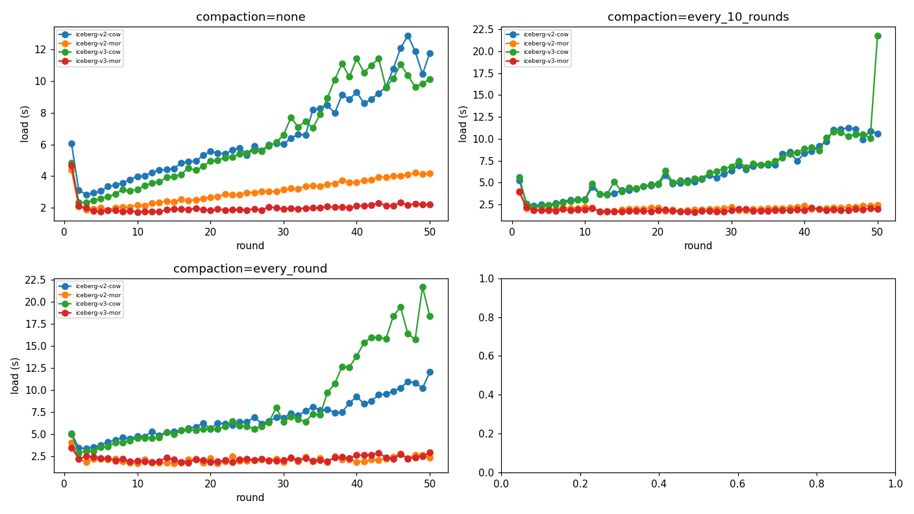
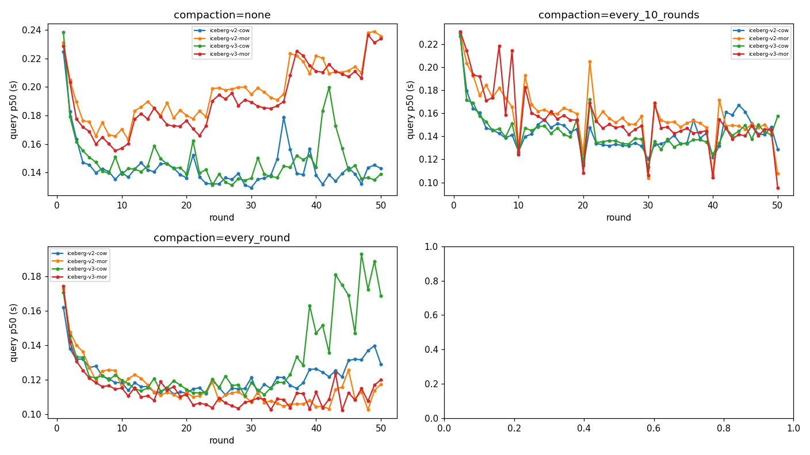
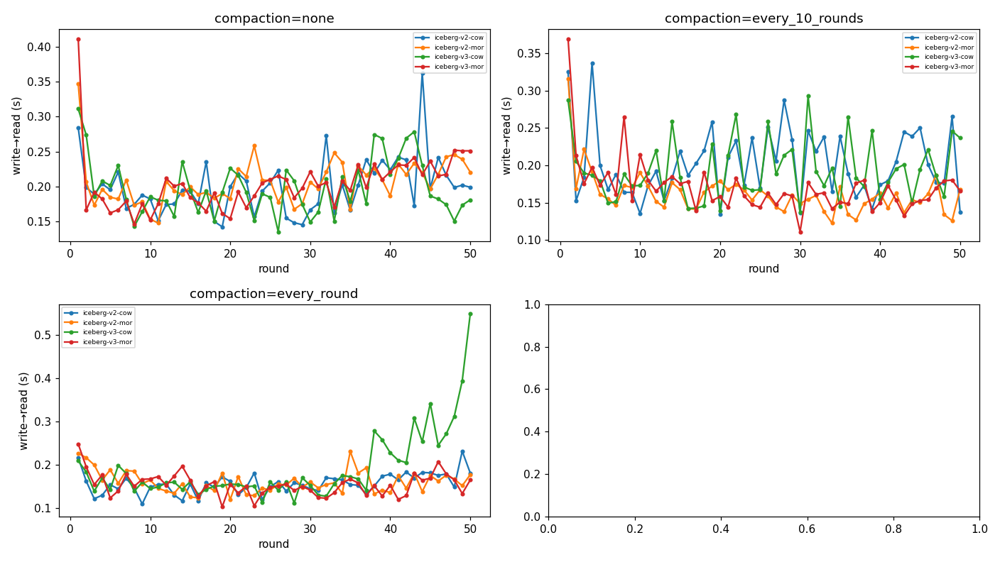
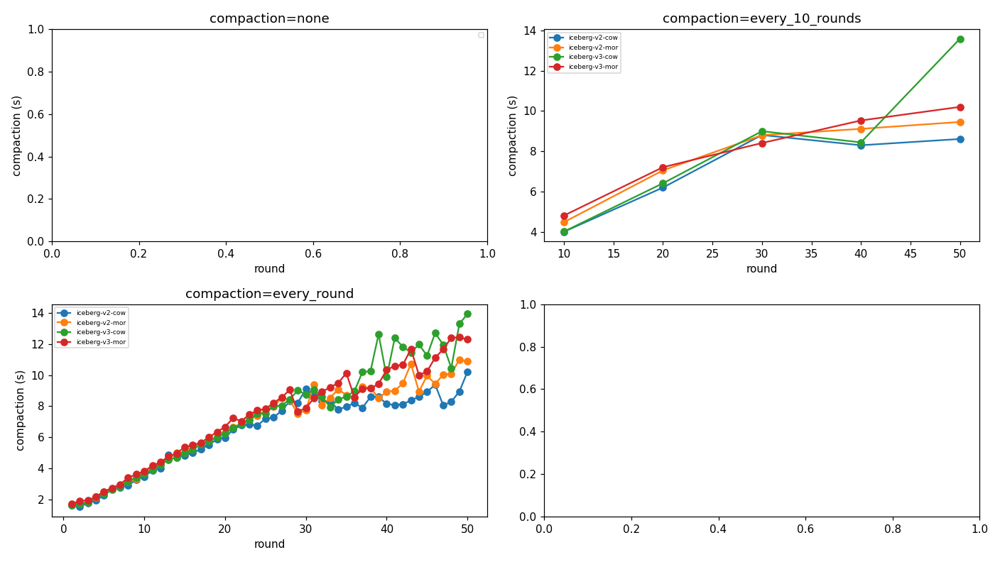
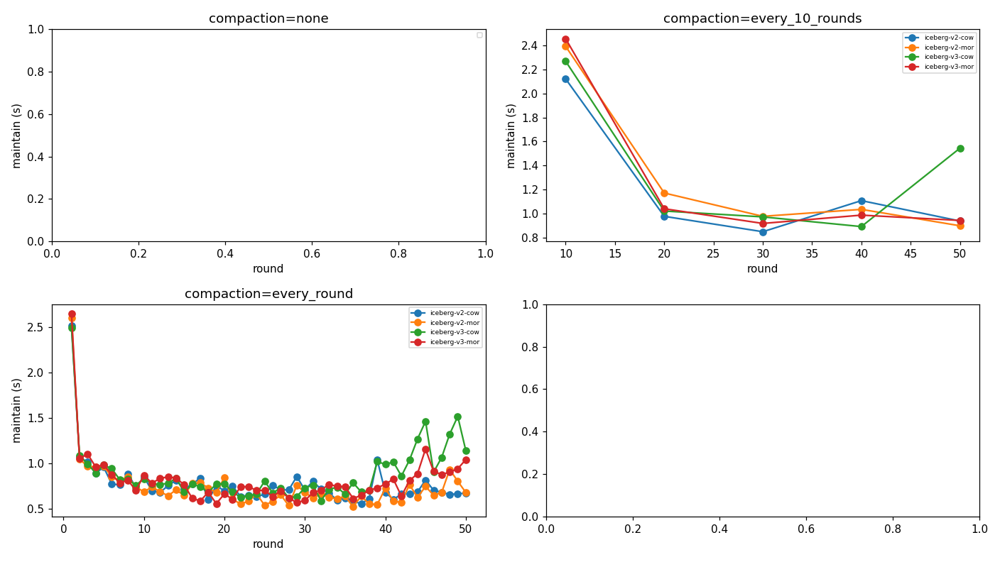

# table-bench-mark 결과 리포트

결과 디렉터리: `bench-20260620-015355` · 라운드 수: 50 · 압축: zstd(Parquet)

## 0. 방법론 · 지표 정의

- **목적**: 쓰기가 빈번한 워크로드에서 Iceberg 구성별 **적재→조회 지연**을 공정하게 비교.
- **적재 엔진** = Apache Spark(`MERGE INTO` 업서트), **조회 엔진** = 설정된 `read_engines`(현재 Spark; StarRocks 옵션). 카탈로그 = Polaris(REST), 스토리지 = MinIO(S3).
- **시나리오** = Iceberg 포맷버전(v2/v3) × 쓰기모드(COW/MOR). **compaction 모드** = none / every_10_rounds / every_round (Spark `rewrite_data_files`, MOR의 deletion vector·delete를 데이터파일에 흡수).
- **시나리오당 흐름**: 초기 시드 후 매 라운드 10만 행 업서트(신규 80% + 기존 PK 20% 갱신) → compaction(주기 해당 시) → 각 엔진이 최근 2회차(~20만 행) 조회.
- **지표**:
  - `적재(load)` = staging→테이블 1라운드 쓰기 시간(Spark).
  - `compaction` = rewrite_data_files 1회 시간(Spark).
  - `maintain` = compaction마다 스냅샷 1개만 남기고(expire) orphan 파일 제거하는 시간(별도 추적).
  - `freshness(write→read)` = **커밋 직후 최신 round_id가 조회에 보일 때까지의 지연** (경량 가시성 프로브 폴링; 못 읽으면 실패). 한 write당 1회 측정이라 라운드별 잡음은 정상 — **분포(median/IQR/p95)** 로 해석.
  - `조회(query)` = 가시화 이후 정상상태 조회 지연(반복 측정 p50).
- **공정성·정밀도**: 랜덤 데이터는 사전 시드 Parquet으로 1회 생성(측정 제외)·동일 바이트, Polaris 메타데이터 캐시 비활성, 후보마다 새 테이블(격리), **측정 직전 정착(settle, 타이머 밖)**, 컨테이너 자원 캡 + Docker VM 사이징으로 스왑/경합 차단. **신뢰도**는 전체 매트릭스 **N회 반복·평균**(run 간 평균·변동성)으로 확보.
- **비교 관점**: compaction 정책별 패널에서 방식 비교 + 쌍대(COW vs MOR / v2-MOR vs v3-MOR / v2-COW vs v3-COW).

## 1. 호환성 매트릭스 (✓ 정상 / △ 부분 / ✗ 불가 / - 없음)

| 시나리오           | compaction      | spark   |
|----------------|-----------------|---------|
| iceberg-v2-cow | none            | ✓       |
| iceberg-v2-cow | every_10_rounds | ✓       |
| iceberg-v2-cow | every_round     | ✓       |
| iceberg-v2-mor | none            | ✓       |
| iceberg-v2-mor | every_10_rounds | ✓       |
| iceberg-v2-mor | every_round     | ✓       |
| iceberg-v3-cow | none            | ✓       |
| iceberg-v3-cow | every_10_rounds | ✓       |
| iceberg-v3-cow | every_round     | ✓       |
| iceberg-v3-mor | none            | ✓       |
| iceberg-v3-mor | every_10_rounds | ✓       |
| iceberg-v3-mor | every_round     | ✓       |

## 2. 조회 지연 (정상상태 p50 평균, 초)

| 시나리오           | compaction      |   spark |
|----------------|-----------------|---------|
| iceberg-v2-cow | none            |   0.144 |
| iceberg-v2-cow | every_10_rounds |   0.144 |
| iceberg-v2-cow | every_round     |   0.122 |
| iceberg-v2-mor | none            |   0.197 |
| iceberg-v2-mor | every_10_rounds |   0.158 |
| iceberg-v2-mor | every_round     |   0.116 |
| iceberg-v3-cow | none            |   0.149 |
| iceberg-v3-cow | every_10_rounds |   0.143 |
| iceberg-v3-cow | every_round     |   0.132 |
| iceberg-v3-mor | none            |   0.191 |
| iceberg-v3-mor | every_10_rounds |   0.155 |
| iceberg-v3-mor | every_round     |   0.113 |

## 3. 신선도 write→read (커밋→조회가능 지연 평균, 초)

| 시나리오           | compaction      |   spark |
|----------------|-----------------|---------|
| iceberg-v2-cow | none            |   0.2   |
| iceberg-v2-cow | every_10_rounds |   0.202 |
| iceberg-v2-cow | every_round     |   0.157 |
| iceberg-v2-mor | none            |   0.206 |
| iceberg-v2-mor | every_10_rounds |   0.162 |
| iceberg-v2-mor | every_round     |   0.161 |
| iceberg-v3-cow | none            |   0.199 |
| iceberg-v3-cow | every_10_rounds |   0.194 |
| iceberg-v3-cow | every_round     |   0.191 |
| iceberg-v3-mor | none            |   0.203 |
| iceberg-v3-mor | every_10_rounds |   0.171 |
| iceberg-v3-mor | every_round     |   0.155 |

## 4. 적재 · compaction · maintain(스냅샷 expire+orphan) 비용 (초)

| 시나리오           | compaction      |   적재 평균(s) | compaction 평균(s)   |   compaction 총합(s) | maintain 평균(s)   |   maintain 총합(s) |
|----------------|-----------------|------------|--------------------|--------------------|------------------|------------------|
| iceberg-v2-cow | none            |      6.53  | —                  |                0   | —                |              0   |
| iceberg-v2-cow | every_10_rounds |      6.092 | 7.187              |               35.9 | 1.199            |              6   |
| iceberg-v2-cow | every_round     |      6.775 | 6.362              |              318.1 | 0.772            |             38.6 |
| iceberg-v2-mor | none            |      3.019 | —                  |                0   | —                |              0   |
| iceberg-v2-mor | every_10_rounds |      2.074 | 7.782              |               38.9 | 1.295            |              6.5 |
| iceberg-v2-mor | every_round     |      2.123 | 6.824              |              341.2 | 0.743            |             37.2 |
| iceberg-v3-cow | none            |      6.391 | —                  |                0   | —                |              0   |
| iceberg-v3-cow | every_10_rounds |      6.419 | 8.292              |               41.5 | 1.340            |              6.7 |
| iceberg-v3-cow | every_round     |      8.368 | 7.399              |              370   | 0.887            |             44.3 |
| iceberg-v3-mor | none            |      2.034 | —                  |                0   | —                |              0   |
| iceberg-v3-mor | every_10_rounds |      1.888 | 8.034              |               40.2 | 1.269            |              6.3 |
| iceberg-v3-mor | every_round     |      2.223 | 7.301              |              365   | 0.815            |             40.8 |

## 5. compaction 정책별 방식 비교 (각 정책 하에서 v2/v3 × COW/MOR)

> CV(변동계수)는 라운드 간 변동성. freshness 는 단일 콜드 측정이라 CV 가 query 보다 큼(정상).

### compaction = `none`

| 방식     |   적재(s) |   freshness(s) | fresh CV   |   조회 p50(s) | 조회 CV   |
|--------|---------|----------------|------------|-------------|---------|
| v2-COW |   6.53  |          0.2   | 20%        |       0.144 | 11%     |
| v2-MOR |   3.019 |          0.206 | 15%        |       0.197 | 10%     |
| v3-COW |   6.391 |          0.199 | 20%        |       0.149 | 12%     |
| v3-MOR |   2.034 |          0.203 | 20%        |       0.191 | 11%     |

### compaction = `every_10_rounds`

| 방식     |   적재(s) |   freshness(s) | fresh CV   |   조회 p50(s) | 조회 CV   |
|--------|---------|----------------|------------|-------------|---------|
| v2-COW |   6.092 |          0.202 | 23%        |       0.144 | 12%     |
| v2-MOR |   2.074 |          0.162 | 18%        |       0.158 | 14%     |
| v3-COW |   6.419 |          0.194 | 21%        |       0.143 | 12%     |
| v3-MOR |   1.888 |          0.171 | 22%        |       0.155 | 17%     |

### compaction = `every_round`

| 방식     |   적재(s) |   freshness(s) | fresh CV   |   조회 p50(s) | 조회 CV   |
|--------|---------|----------------|------------|-------------|---------|
| v2-COW |   6.775 |          0.157 | 15%        |       0.122 | 8%      |
| v2-MOR |   2.123 |          0.161 | 16%        |       0.116 | 11%     |
| v3-COW |   8.368 |          0.191 | 41%        |       0.132 | 17%     |
| v3-MOR |   2.223 |          0.155 | 17%        |       0.113 | 10%     |

## 6. 쌍대 비교 (COW vs MOR · v2 vs v3)

### COW vs MOR (v2) — 비율 = v2-MOR ÷ v2-COW (＜1 이면 v2-MOR 가 더 낮음)

| compaction      |   적재 v2-COW |   적재 v2-MOR | 비율    |   fresh v2-COW |   fresh v2-MOR | 비율    |   조회 v2-COW |   조회 v2-MOR | 비율    |
|-----------------|-------------|-------------|-------|----------------|----------------|-------|-------------|-------------|-------|
| none            |       6.53  |       3.019 | 0.46× |          0.2   |          0.206 | 1.03× |       0.144 |       0.197 | 1.37× |
| every_10_rounds |       6.092 |       2.074 | 0.34× |          0.202 |          0.162 | 0.80× |       0.144 |       0.158 | 1.10× |
| every_round     |       6.775 |       2.123 | 0.31× |          0.157 |          0.161 | 1.02× |       0.122 |       0.116 | 0.95× |

### COW vs MOR (v3) — 비율 = v3-MOR ÷ v3-COW (＜1 이면 v3-MOR 가 더 낮음)

| compaction      |   적재 v3-COW |   적재 v3-MOR | 비율    |   fresh v3-COW |   fresh v3-MOR | 비율    |   조회 v3-COW |   조회 v3-MOR | 비율    |
|-----------------|-------------|-------------|-------|----------------|----------------|-------|-------------|-------------|-------|
| none            |       6.391 |       2.034 | 0.32× |          0.199 |          0.203 | 1.02× |       0.149 |       0.191 | 1.28× |
| every_10_rounds |       6.419 |       1.888 | 0.29× |          0.194 |          0.171 | 0.88× |       0.143 |       0.155 | 1.08× |
| every_round     |       8.368 |       2.223 | 0.27× |          0.191 |          0.155 | 0.81× |       0.132 |       0.113 | 0.86× |

### v2-MOR vs v3-MOR — 비율 = v3-MOR ÷ v2-MOR (＜1 이면 v3-MOR 가 더 낮음)

| compaction      |   적재 v2-MOR |   적재 v3-MOR | 비율    |   fresh v2-MOR |   fresh v3-MOR | 비율    |   조회 v2-MOR |   조회 v3-MOR | 비율    |
|-----------------|-------------|-------------|-------|----------------|----------------|-------|-------------|-------------|-------|
| none            |       3.019 |       2.034 | 0.67× |          0.206 |          0.203 | 0.99× |       0.197 |       0.191 | 0.97× |
| every_10_rounds |       2.074 |       1.888 | 0.91× |          0.162 |          0.171 | 1.06× |       0.158 |       0.155 | 0.98× |
| every_round     |       2.123 |       2.223 | 1.05× |          0.161 |          0.155 | 0.96× |       0.116 |       0.113 | 0.98× |

### v2-COW vs v3-COW — 비율 = v3-COW ÷ v2-COW (＜1 이면 v3-COW 가 더 낮음)

| compaction      |   적재 v2-COW |   적재 v3-COW | 비율    |   fresh v2-COW |   fresh v3-COW | 비율    |   조회 v2-COW |   조회 v3-COW | 비율    |
|-----------------|-------------|-------------|-------|----------------|----------------|-------|-------------|-------------|-------|
| none            |       6.53  |       6.391 | 0.98× |          0.2   |          0.199 | 0.99× |       0.144 |       0.149 | 1.03× |
| every_10_rounds |       6.092 |       6.419 | 1.05× |          0.202 |          0.194 | 0.96× |       0.144 |       0.143 | 1.00× |
| every_round     |       6.775 |       8.368 | 1.24× |          0.157 |          0.191 | 1.22× |       0.122 |       0.132 | 1.08× |

## 7. 그래프 (패널=compaction · 선=방식)

### 적재 시간 vs 라운드 (compaction 주기별 패널 · 방식 비교)

### 조회 지연 vs 라운드 (compaction 주기별 패널 · 방식 비교)

### 신선도 write→read vs 라운드 (compaction 주기별 패널 · 방식 비교)

### compaction 시간 vs 라운드 (compaction 주기별 패널 · 방식 비교)

### 스냅샷 expire+orphan 제거 시간 vs 라운드 (compaction 주기별 패널 · 방식 비교)

## 8. 시나리오별 해설

- **iceberg-v2-cow**: 적재 6.1s→11.8s (증가(테이블 성장 비례, COW 특성)). compaction 평균 6.4s. Spark freshness 0.200s.
- **iceberg-v2-mor**: 적재 4.4s→4.2s (평탄(MOR 특성)). compaction 평균 6.8s. Spark freshness 0.206s.
- **iceberg-v3-cow**: 적재 4.8s→10.1s (증가(테이블 성장 비례, COW 특성)). compaction 평균 7.4s. Spark freshness 0.199s.
- **iceberg-v3-mor**: 적재 4.7s→2.2s (평탄(MOR 특성)). compaction 평균 7.3s. Spark freshness 0.203s.

## 9. 종합 해설

- **spark** 최저 조회 지연: `iceberg-v3-mor` / every_round (0.113s)

### 결론 — freshness · write/read 확보에 좋은 구성

- **적재(write) 최저**: `v3-MOR` / every_10_rounds (1.888s) — MOR 계열이 평탄·저비용.
- **조회(read) 최저 p50**: `v3-MOR` / every_round (0.113s).
- **freshness 최저**: `v3-MOR` / every_round (0.155s).
- **균형 종합 권장**: `v3-MOR` / `every_round` (정규화 점수 1.06, 1.0=모든 지표 최저) — 적재·freshness·조회를 동일 가중으로 합산한 최적. 실시간·쓰기빈번(적재→조회 지연 최소화) 워크로드 기준.
